# SmartMove Backend — Technical Documentation Suite

> **Version**: 1.0.0 · **Generated**: June 2026 · **Stack**: Django 5 · DRF · Celery · Channels · PostgreSQL · Azure SQL

---

# Part I — Global System Architecture Overview

## 1. Platform Engine Overview

The SmartMove Django backend is the **central nervous system** of a multi-region real estate analytics platform serving Egypt, Dubai, and England. It orchestrates the complete lifecycle of property intelligence — from raw CSV ingestion through Azure Blob Storage and Airflow ETL pipelines, to AI-powered conversational analytics via LangChain agents and real-time WebSocket delivery.

The backend is not a simple CRUD API. It is an event-driven, multi-tenant system that coordinates five critical operational planes:

| Plane | Responsibility |
|---|---|
| **Identity & Access** | Email/OAuth authentication, RBAC (USER → DATA_ANALYST → ADMIN), OTP verification, session management |
| **Data Pipeline** | Direct-to-Azure uploads, Airflow webhook handoffs, virus-scan state machines, Google Drive/OneDrive cloud imports |
| **Intelligence** | Conversational AI (LangChain ReAct agent) over Azure SQL, ML forecasting via Prophet, PDF report generation |
| **Monetization** | Stripe billing with Tri-Layer storage quotas, tiered report paywalls, subscription matrix |
| **Observability** | Prometheus metrics, Sentry error tracking, OpenTelemetry tracing, SOC self-healing runbooks via Alertmanager |

## 2. High-Level Architecture Diagram

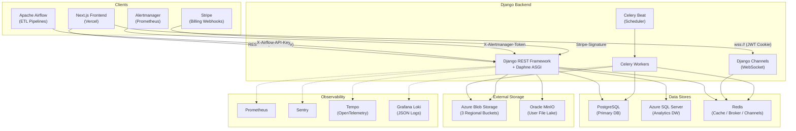

## 3. Core Application Map

### 🔐 Auth & Users
- **`authentication`** — Registration, login (email + Google + Microsoft OAuth), OTP email verification, password flows, JWT cookie management.
- **`users`** — Custom `User` model (email-based, no username), RBAC roles, audit logging, profile photo uploads, session management.

### 📊 Core Data Processing
- **`upload`** — SAS token generation for direct-to-Azure uploads, DataImport state machine, Airflow webhook receiver, storage quota enforcement.
- **`integrations`** — Google Drive & OneDrive OAuth connections, cloud file listing/preview/transfer to Azure.
- **`predictions`** — Read-only ORM over `fact_forecasts` (unmanaged table populated by Airflow ML pipeline), RBAC forecast horizon limiting.
- **`reports`** — Monthly PDF report generation (HTML → WeasyPrint), tiered paywall (view/download by age), Airflow pipeline status tracking.
- **`analytics_pro_engine`** — User file management on Oracle MinIO, quarantine/scan/promote workflow, AI dashboard generation via Celery.

### 🤖 AI & Conversational
- **`chatbot`** — Real-time WebSocket consumer with LangChain ReAct agent, daily query quotas by role, prompt injection defense, semantic caching, full audit trail.
- **`agentic_ai`** — Multi-agent swarm sessions for deep analysis of user-uploaded datasets, token usage accounting.

### 💳 Monetization
- **`subscriptions`** — Stripe Checkout integration, webhook event routing, Tri-Layer storage math, subscription matrix, Airflow mailing list API.
- **`currency`** — Consensus Oracle fetching rates from 3 APIs, data-poisoning protection, anomaly detection, Redis-cached conversions.

### 🛡️ Observability & Platform
- **`monitoring`** — SOC command center: Alertmanager webhook receiver, self-healing runbook dispatch (restart Celery, flush Redis, scale pods).
- **`core`** — Shared AI service manager (LLM provider abstraction layer).
- **`dashboard`** — Placeholder for future dashboard aggregation APIs.
- **`notifications`** — Placeholder for future push notification system.

## 4. Global Configurations

| Concern | Implementation |
|---|---|
| **Authentication** | `CookieJWTAuthentication` — extracts JWT from `access_token` HttpOnly cookie with CSRF enforcement; falls back to `Authorization` header |
| **Access Tokens** | 15-minute access / 7-day refresh; blacklist-on-logout via `simplejwt.token_blacklist` |
| **Rate Limiting** | `django-ratelimit` on login (5/min/IP); Redis-backed daily chatbot quotas per user |
| **Middleware Stack** | `PrometheusBeforeMiddleware` → Security → Session → CORS → CSRF → Auth → Messages → Clickjacking → `PrometheusAfterMiddleware` |
| **API Documentation** | Auto-generated OpenAPI 3 via `drf-spectacular` at `/api/docs/` (Swagger) and `/api/redoc/` |
| **Logging** | Structured JSON via `pythonjsonlogger` → stdout → Grafana Loki |
| **Error Tracking** | Sentry SDK with Django, Celery, and Redis integrations (0.2 trace sample rate) |
| **Distributed Tracing** | OpenTelemetry → OTLP/gRPC → Grafana Tempo (opt-in via `OTEL_ENABLED`) |
| **CORS** | Explicit allowlist: `localhost:3000/3001`, Vercel production domain; credentials enabled |
| **Databases** | PostgreSQL (primary), Azure SQL/MSSQL (analytics warehouse, opt-in via `USE_AZURE_DB`) |

---
---

# Part II — Individual App Documentation

---

# App 1: `authentication`

## 1. App Purpose

The `authentication` app implements the complete identity lifecycle for the SmartMove platform. It handles user registration with email verification via time-limited OTP codes, multi-provider social authentication (Google OAuth, Microsoft Graph), secure JWT issuance via HttpOnly cookies, password reset/change flows with OTP confirmation, and admin-only role management. Every authentication event is audit-logged to the `AuditLog` model for SOC analysis.

## 2. Entity Relationship Diagram

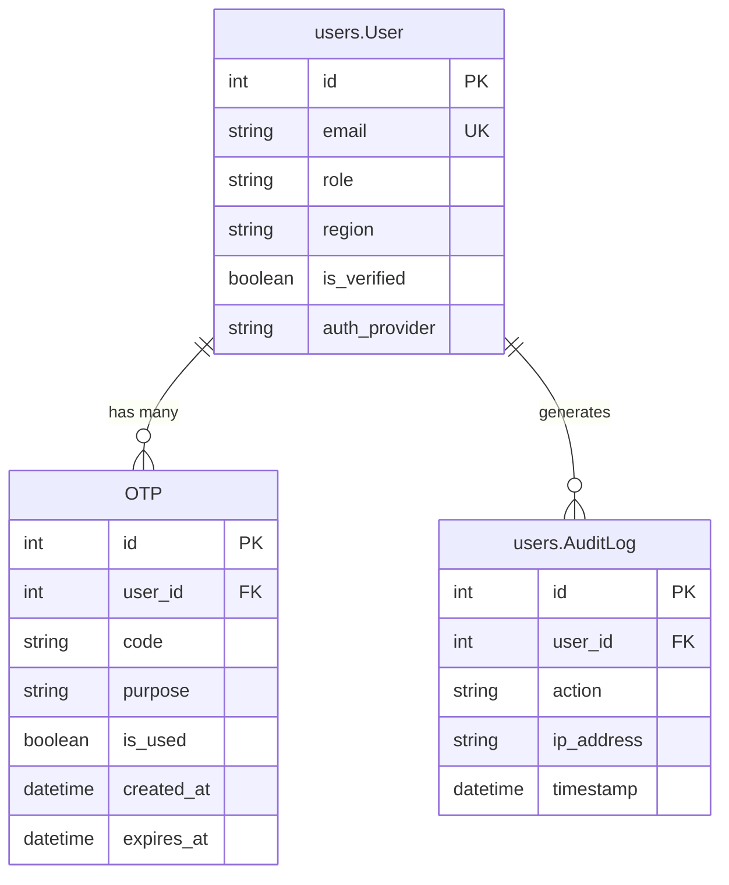

## 3. Data Models

| Model | Purpose | Key Fields |
|---|---|---|
| `OTP` | Time-limited one-time password for email verification, password reset, and email change flows | `user` (FK → User), `code` (6-digit), `purpose` (enum: verify_email, reset_password, change_password, change_email), `is_used`, `expires_at` |

## 4. Core Business Logic

**Cookie-Based JWT Authentication**: The platform uses a custom `CookieJWTAuthentication` class that extracts the JWT from an `access_token` HttpOnly cookie instead of the `Authorization` header. CSRF enforcement is applied only when the token originates from a cookie, not from a header-based API call.

<details>
<summary><strong>CookieJWTAuthentication — HttpOnly Cookie Extraction</strong></summary>

```python
class CookieJWTAuthentication(JWTAuthentication):
    def authenticate(self, request):
        header = self.get_header(request)
        if header is None:
            raw_token = request.COOKIES.get(
                settings.SIMPLE_JWT['AUTH_COOKIE']
            ) or None
            using_cookie = True
        else:
            raw_token = self.get_raw_token(header)
            using_cookie = False
        if raw_token is None:
            return None
        validated_token = self.get_validated_token(raw_token)
        if using_cookie:
            self.enforce_csrf(request)
        return self.get_user(validated_token), validated_token
```
</details>

**Social Auth Conflict Detection**: When a user authenticates via Google or Microsoft, the system checks if their email is already registered with a different auth provider. If the email was registered via email/password, social login is blocked to prevent account takeover. New social auth users are forced to select a region before JWT issuance.

**Rate-Limited Login with Audit Trail**: Login attempts are rate-limited to 5/minute/IP via `django-ratelimit`. Every failed attempt, unverified login, and successful login is recorded in the `AuditLog` with the client IP.

## 5. API Endpoints & Interfaces

| Endpoint | Method | Auth | Description |
|---|---|---|---|
| `/api/auth/csrf/` | GET | Public | Sets the CSRF cookie for subsequent requests |
| `/api/auth/register/` | POST | Public | Creates user, sends OTP email for verification |
| `/api/auth/verify-email/` | POST | Public | Validates OTP and marks user as verified |
| `/api/auth/login/` | POST | Public | Rate-limited (5/min). Returns JWT in HttpOnly cookies |
| `/api/auth/logout/` | POST | Public | Blacklists refresh token, clears all auth cookies |
| `/api/auth/refresh/` | POST | Public | Rotates access token from refresh cookie |
| `/api/auth/forgot-password/` | POST | Public | Sends reset OTP (does not reveal if email exists) |
| `/api/auth/reset-password/` | POST | Public | Verifies OTP + sets new password |
| `/api/auth/change-password/request/` | POST | JWT | Sends OTP to confirm password change |
| `/api/auth/change-password/verify/` | POST | JWT | Verifies OTP and applies new password |
| `/api/auth/region/` | PATCH | JWT | Updates user's region selection |
| `/api/auth/users/<id>/role/` | PATCH | Admin | Updates a user's RBAC role |
| `/api/auth/google/` | POST | Public | Google OAuth token exchange |
| `/api/auth/google/set-region/` | POST | Public | Sets region for new Google users |
| `/api/auth/microsoft/` | POST | Public | Microsoft OAuth token exchange |
| `/api/auth/microsoft/set-region/` | POST | Public | Sets region for new Microsoft users |

---

# App 2: `users`

## 1. App Purpose

The `users` app defines the platform's custom `User` model (email-based, no username) and the `AuditLog` model for security event tracking. It provides both self-service profile management endpoints (profile editing, photo upload, email change, session listing) and admin-only user management (CRUD, role assignment, account deletion). A Django signal system auto-disconnects WebSocket sessions when a user's role changes or their account is deactivated.

## 2. Entity Relationship Diagram

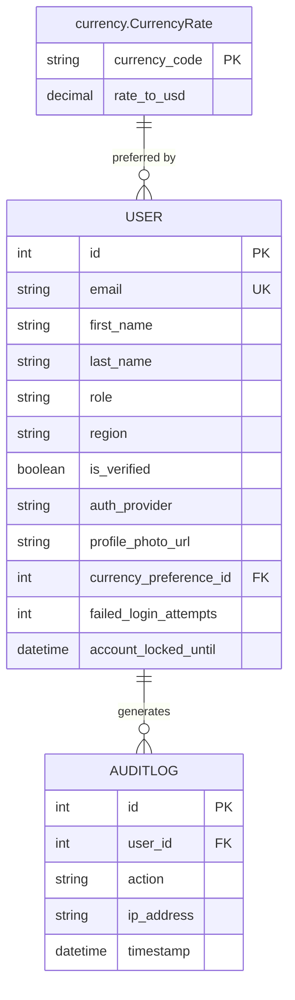

## 3. Data Models

| Model | Purpose | Key Fields |
|---|---|---|
| `User` | Custom user model using email as the sole identifier. Supports RBAC roles (ADMIN, DATA_ANALYST, USER), multi-region assignment, and multi-provider auth | `email` (unique), `role`, `region`, `is_verified`, `auth_provider`, `currency_preference` (FK → CurrencyRate), `profile_photo_url` |
| `AuditLog` | Immutable security event journal. Tracks login attempts, failures, and admin actions | `user` (FK, nullable for failed logins), `action`, `ip_address`, `timestamp` |

## 4. Core Business Logic

**WebSocket Force-Disconnect Signal**: A `post_save` signal on the `User` model detects when a user is deactivated or their role changes. It broadcasts a `force_disconnect` event through Django Channels, immediately terminating the user's chatbot WebSocket session.

<details>
<summary><strong>Signal: Auto-disconnect on role change or deactivation</strong></summary>

```python
@receiver(post_save, sender=User)
def disconnect_user_on_change(sender, instance, created, **kwargs):
    if created:
        return
    old_is_active = getattr(instance, '_original_is_active', instance.is_active)
    old_role = getattr(instance, '_original_role', instance.role)
    if (old_is_active and not instance.is_active) or (old_role != instance.role):
        channel_layer = get_channel_layer()
        if channel_layer is not None:
            async_to_sync(channel_layer.group_send)(
                f"user_{instance.pk}",
                {"type": "force_disconnect"},
            )
```
</details>

**Profile Completion Calculator**: The `User.profile_completion` property computes a percentage score based on filled profile fields, used by the frontend to display progress indicators.

**Custom User Manager**: `CustomUserManager` overrides Django's default user creation to use email as the sole identifier, with automatic `is_staff` and `is_superuser` flags for superuser creation.

## 5. API Endpoints & Interfaces

| Endpoint | Method | Auth | Description |
|---|---|---|---|
| `/api/users/me/` | GET / PATCH | JWT | Retrieve or update the current user's profile |
| `/api/users/me/photo/` | POST | JWT | Upload profile photo to Azure Blob Storage |
| `/api/users/me/change-email/` | POST | JWT | Request email change (sends OTP to new email) |
| `/api/users/me/verify-email-change/` | POST | JWT | Verify OTP and apply new email |
| `/api/users/me/sessions/` | GET / DELETE | JWT | List active sessions or revoke all (logout everywhere) |
| `/api/users/list/` | GET | Admin | List all users with pagination |
| `/api/users/<id>/` | GET / PATCH / DELETE | Admin | Retrieve, update, or delete a specific user |

---

# App 3: `upload`

## 1. App Purpose

The `upload` app manages the secure, quota-enforced ingestion of real estate data files into the SmartMove platform. It implements a two-step upload flow: (1) generate a write-only SAS token for direct browser-to-Azure upload, and (2) register the completed upload in the database for Airflow ETL processing. A Celery Beat task sweeps for zombie imports every 5 minutes. The app also serves as the Airflow webhook receiver for pipeline status updates.

## 2. Entity Relationship Diagram

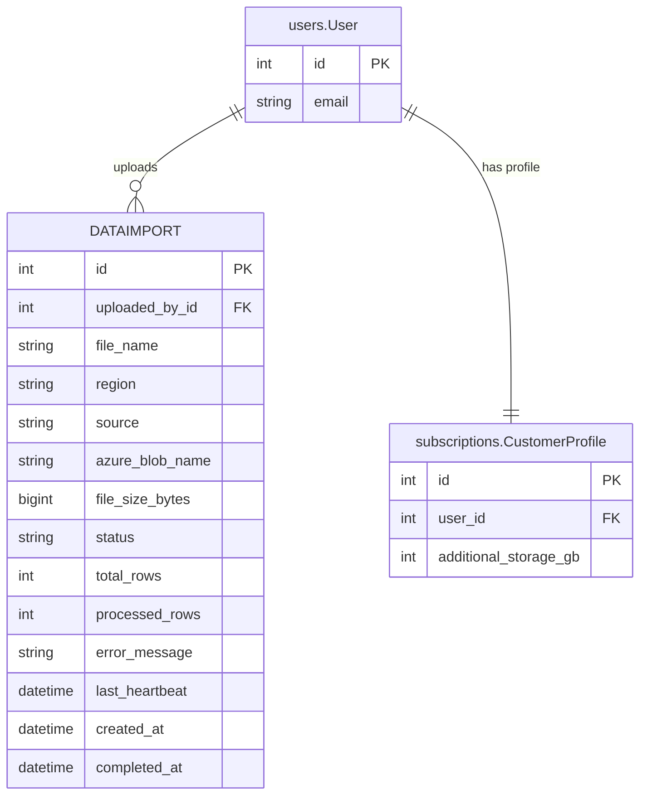

## 3. Data Models

| Model | Purpose | Key Fields |
|---|---|---|
| `DataImport` | Central tracker for every file uploaded to the system, with a 5-state status machine | `uploaded_by` (FK → User), `file_name`, `region` (Egypt/Dubai/England), `source` (local/google/microsoft), `status` (PENDING_VIRUS_SCAN → PROCESSING_ETL → COMPLETED), `azure_blob_name`, `file_size_bytes`, `last_heartbeat` |

## 4. Core Business Logic

**Tri-Layer Storage Quota Enforcement**: Before issuing a SAS token, the system computes the user's total storage allowance by calling `CustomerProfile.get_total_storage_allowance()` (Base tier + Bundle bonus + Slider add-on). It then sums all non-quarantined uploads to check if the incoming file would exceed the quota. This check runs twice — at SAS issuance (Step 1) and at registration (Step 2) — as a belt-and-suspenders guard against concurrent uploads.

<details>
<summary><strong>Storage Quota Gate — Tri-Layer Math</strong></summary>

```python
def _check_storage_quota(user, incoming_file_size_bytes):
    try:
        profile = user.stripe_profile
        total_allowance_gb = profile.get_total_storage_allowance()
    except CustomerProfile.DoesNotExist:
        total_allowance_gb = 1  # Free-tier default
    total_allowance_bytes = total_allowance_gb * 1_073_741_824
    current_usage = int(
        DataImport.objects.filter(uploaded_by=user)
        .exclude(status__in=['FAILED_SECURITY_QUARANTINE'])
        .aggregate(total=Sum('file_size_bytes'))['total'] or 0
    )
    is_allowed = (current_usage + incoming_file_size_bytes) <= total_allowance_bytes
    return is_allowed, total_allowance_bytes, current_usage
```
</details>

**Azure SAS Token Scoping**: Each generated SAS URL is scoped to a unique blob path that includes the user ID, a UUID fragment, and the original filename. The token grants write-only access and expires in 4 hours.

**Airflow Webhook Receiver**: A separate endpoint (`/api/upload/webhook/airflow/`) accepts status updates from the Airflow ETL pipeline, authenticated via a shared `X-Airflow-API-Key` header. It updates the `DataImport` status and records completion timestamps.

## 5. API Endpoints & Interfaces

| Endpoint | Method | Auth | Description |
|---|---|---|---|
| `/api/upload/sas-token/` | POST | Admin | Generates a write-only Azure SAS URL for direct upload |
| `/api/upload/register/` | POST | Admin | Registers a completed Azure upload, verifies blob existence |
| `/api/upload/list/` | GET | Admin | Lists all DataImport records (Recent Imports table) |
| `/api/upload/webhook/airflow/` | POST | Shared Secret | Airflow status callback (status, rows, errors) |

---

# App 4: `reports`

## 1. App Purpose

The `reports` app manages monthly executive-summary PDF reports generated per region by the Airflow pipeline. It implements a tiered paywall system based on user role and report age, provides machine-to-machine endpoints for Airflow to trigger PDF generation (HTML → WeasyPrint), upload to Azure Blob Storage, dispatch email notifications, and update regional pipeline statuses. Report views/downloads are audit-logged with Prometheus counter instrumentation.

## 2. Entity Relationship Diagram

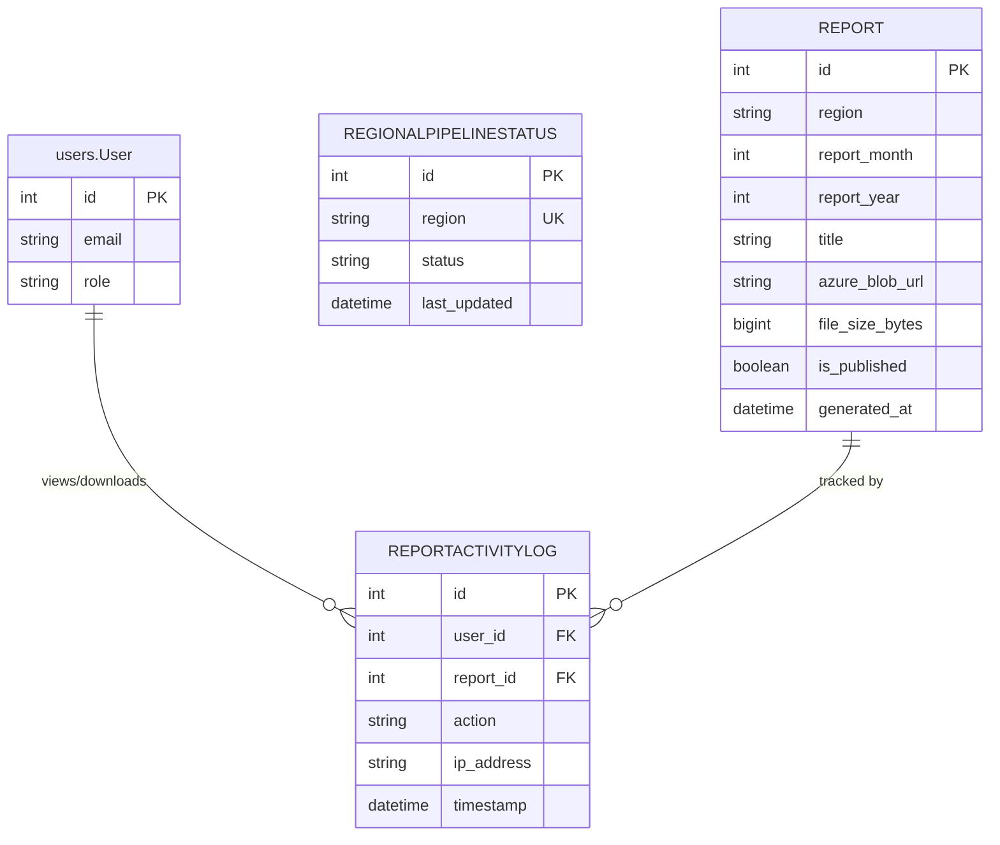

## 3. Data Models

| Model | Purpose | Key Fields |
|---|---|---|
| `Report` | Monthly executive summary with a unique constraint per region/month/year | `region`, `report_month`, `report_year`, `azure_blob_url`, `file_size_bytes`, `is_published`, `age_months` (computed property) |
| `ReportActivityLog` | Audit trail for every report view and download, with IP tracking | `user` (FK), `report` (FK), `action` (VIEW/DOWNLOAD), `ip_address` |
| `RegionalPipelineStatus` | Tracks the last-known state of each region's Airflow pipeline | `region` (unique), `status` (SUCCESS/FAILED/RUNNING) |

## 4. Core Business Logic

**Tiered Paywall Engine**: The `age_months` property on `Report` drives a role-based access matrix:

| Role / Report Age | `can_view` | `can_download` |
|---|---|---|
| DATA_ANALYST / ADMIN | ✅ Always | ✅ Always |
| USER (0–2 months old) | ✅ | ✅ |
| USER (2–6 months old) | ✅ | ❌ |
| USER (6+ months old) | ❌ 403 | ❌ 403 |

**PDF Generation Pipeline**: The `BuildPdfView` accepts HTML content from Airflow and converts it to PDF using WeasyPrint via `html_to_pdf()`. The PDF is saved locally first, then uploaded to Azure via a separate `UploadAzureView` endpoint. Finally, `DispatchEmailView` emails the report URL to subscribed users.

## 5. API Endpoints & Interfaces

| Endpoint | Method | Auth | Description |
|---|---|---|---|
| `/api/reports/` | GET | JWT | Paywall-gated list of published reports |
| `/api/reports/build-pdf/` | POST | Airflow Secret | HTML → PDF generation (M2M from Airflow) |
| `/api/reports/<id>/upload-azure/` | POST | Airflow Secret | Upload generated PDF to Azure Blob Storage |
| `/api/reports/dispatch/` | POST | Airflow Secret | Email report URL to recipients |
| `/api/reports/status/update/` | POST | Airflow Secret | Update regional pipeline status |

---

# App 5: `predictions`

## 1. App Purpose

The `predictions` app serves ML-generated property price forecasts from the `fact_forecasts` table, which is populated exclusively by the Airflow ML pipeline (Prophet models). Django treats this table as **read-only** (`managed = False`). The API enforces role-based access control on the forecast horizon: standard users see 36 months, analysts and admins see 120 months.

## 2. Entity Relationship Diagram

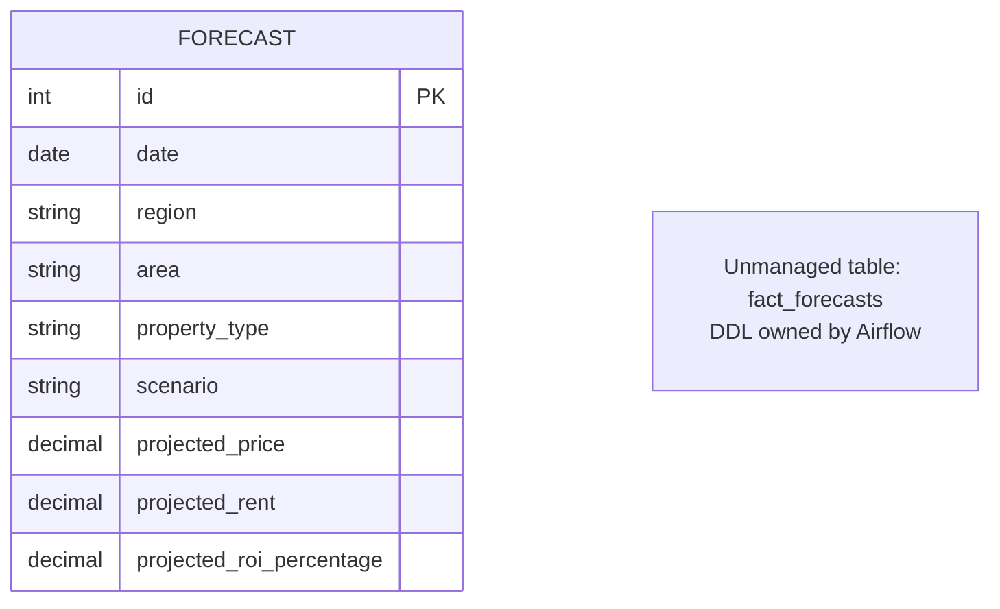

## 3. Data Models

| Model | Purpose | Key Fields |
|---|---|---|
| `Forecast` | Read-only ORM mapping to `fact_forecasts`. Contains multi-scenario (Normal, Best_Case, Worst_Case) projections per region, area, and property type | `date`, `region`, `area`, `property_type`, `scenario`, `projected_price`, `projected_rent`, `projected_roi_percentage` |

## 4. Core Business Logic

**Role-Based Horizon Limiting**: The forecast endpoint dynamically caps the `date__lte` filter based on the authenticated user's role. This prevents free-tier users from accessing long-range predictions that are reserved for paying subscribers.

```python
_HORIZON_BY_ROLE = {
    "USER": 36,          # 3 years
    "DATA_ANALYST": 120, # 10 years
    "ADMIN": 120,
}
max_date = date.today() + relativedelta(months=horizon_months)
qs = Forecast.objects.filter(
    region__iexact=region,
    date__gte=date.today(),
    date__lte=max_date,
)
```

## 5. API Endpoints & Interfaces

| Endpoint | Method | Auth | Description |
|---|---|---|---|
| `/api/predictions/forecasts/` | GET | JWT | Returns forecasts filtered by `region` (required), `area`, `scenario`. Horizon capped by role. |

---

# App 6: `chatbot`

## 1. App Purpose

The `chatbot` app is the real-time conversational AI interface of the SmartMove platform. It uses Django Channels with an `AsyncWebSocketConsumer` to deliver a multi-turn, tool-augmented chat experience powered by a LangChain ReAct agent. The system includes daily query quotas by role, prompt-injection sanitization, semantic caching, audio transcription (Whisper), and a full audit trail of every LLM interaction with token accounting for cost dashboards.

## 2. Entity Relationship Diagram

```mermaid
erDiagram
    USERQUOTA {
        int user_id PK_FK
        int queries_used_today
        int max_queries_per_day
        date last_reset
    }

    CONVERSATIONAUDITLOG {
        int id PK
        int user_id FK
        string session_id
        text prompt
        text response
        string model_used
        int prompt_tokens
        int completion_tokens
        int total_tokens
        int response_time_ms
        json tools_invoked
        boolean cache_hit
        datetime created_at
    }

    USER["users.User"] {
        int id PK
        string email
        string role
    }

    CURRENCYRATE["currency.CurrencyRate"] {
        string currency_code PK
    }

    USER ||--|| USERQUOTA : "has quota"
    USER ||--o{ CONVERSATIONAUDITLOG : "generates"
```

## 3. Data Models

| Model | Purpose | Key Fields |
|---|---|---|
| `UserQuota` | Enforces per-day query limits: USER=5, DATA_ANALYST=50, ADMIN=unlimited. Auto-resets at midnight UTC | `user` (1:1), `queries_used_today`, `max_queries_per_day`, `last_reset` |
| `ConversationAuditLog` | Immutable record of every LLM interaction for Grafana dashboards and cost tracking | `session_id`, `prompt`, `response`, `model_used`, `prompt_tokens`, `completion_tokens`, `response_time_ms`, `tools_invoked` (JSON), `cache_hit` |

## 4. Core Business Logic

**8-Stage WebSocket Pipeline**: Each incoming message traverses:
1. Binary/JSON frame detection (audio → Whisper transcription)
2. Redis-based rate limiting (USER: 5/day, bypassed for analysts)
3. DB-based quota check with auto-reset
4. Prompt-injection sanitization filter
5. Semantic cache lookup
6. LangChain ReAct agent execution against Azure SQL
7. Structured JSON response streaming (text, charts, follow-up chips)
8. Audit logging + quota increment

**Dynamic System Prompt Assembly**: The prompt builder injects live exchange rates from the `currency` app, role-specific behavioral guardrails, T-SQL syntax constraints, and the `vw_forecasts_safe` view reference for predictive queries.

<details>
<summary><strong>Admin Broadcast Group — Real-Time Notifications</strong></summary>

```python
# On connect, admin users join the broadcast group
if self.user_role == 'ADMIN' and self.channel_layer is not None:
    await self.channel_layer.group_add(
        'group_ADMIN', self.channel_name,
    )

# Any system can push alerts to all connected admins
async def admin_notification(self, event):
    await self.send(text_data=json.dumps({
        'type': 'system_alert',
        'data': event.get('data', {}),
    }))
```
</details>

## 5. API Endpoints & Interfaces

| Endpoint | Method | Auth | Description |
|---|---|---|---|
| `wss://.../ws/chat/` | WebSocket | JWT Cookie | Primary chat interface (text + audio) |
| `/api/chatbot/quota/` | GET | JWT | Returns current quota status |
| `/api/chatbot/history/` | GET | JWT | Returns conversation audit logs |
| `/api/chatbot/health/` | GET | Public | Health check for load-balancer probes |

---

# App 7: `monitoring`

## 1. App Purpose

The `monitoring` app implements the SmartMove **SOC (Security Operations Center)** self-healing system. It receives Alertmanager webhook payloads from the Prometheus monitoring stack, parses alert metadata, and dynamically dispatches Python-based remediation runbooks for critical alerts. Every action — whether triggered, skipped, successful, or failed — is logged to an immutable audit trail.

## 2. Entity Relationship Diagram

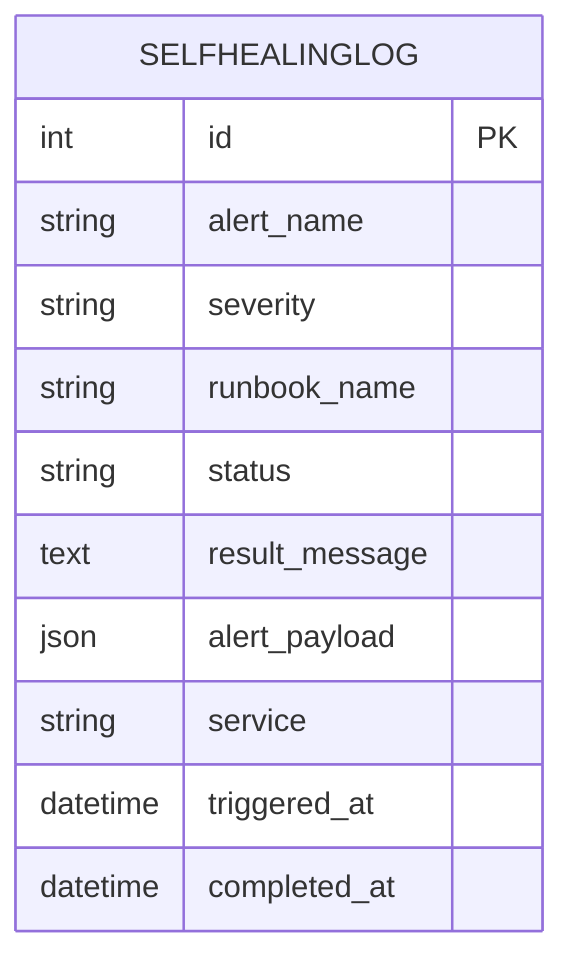

## 3. Data Models

| Model | Purpose | Key Fields |
|---|---|---|
| `SelfHealingLog` | Forensic audit trail of every automated runbook execution | `alert_name`, `severity` (info/warning/critical), `runbook_name`, `status` (triggered/success/failed/skipped), `result_message`, `alert_payload` (full JSON), `service` |

## 4. Core Business Logic

**Runbook Registry Pattern**: Runbooks are plain Python functions registered in a dictionary. The webhook receiver resolves the runbook by matching the `runbook` annotation from the Alertmanager payload against the registry. This allows new runbooks to be added with zero config changes.

```python
RUNBOOK_REGISTRY: dict[str, Callable[[dict], str]] = {
    'restart_celery_workers': restart_celery_workers,
    'flush_redis_cache':      flush_redis_cache,
    'scale_backend_pods':     scale_backend_pods,
}
```

**Timing-Attack-Resistant Auth**: The `HasAlertmanagerSecret` permission uses `hmac.compare_digest` for constant-time comparison of the shared secret, and **fails closed** — if the secret is not configured, all requests are denied.

**Alert Triage Logic**: Only `critical` severity alerts trigger runbook execution. Lower-severity alerts are logged as `SKIPPED`. Resolved alerts are ignored entirely.

## 5. API Endpoints & Interfaces

| Endpoint | Method | Auth | Description |
|---|---|---|---|
| `/api/monitoring/webhook/alertmanager/` | POST | `X-Alertmanager-Token` | Receives Alertmanager payloads, dispatches runbooks |

---

# App 8: `notifications`

## 1. App Purpose

The `notifications` app is a **reserved placeholder** for a future push notification system (email digests, in-app alerts, mobile push). Currently contains the standard Django app scaffold with empty models and views. The app is registered in `INSTALLED_APPS` to allow migrations to be generated when the feature is developed.

## 2. Entity Relationship Diagram

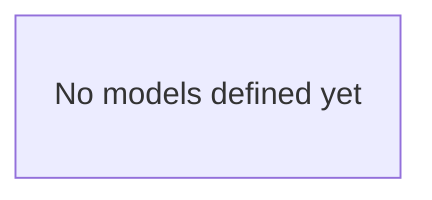

## 3. Data Models

*No models defined — scaffold only.*

## 4. Core Business Logic

*No business logic implemented. Future plans include WebSocket-based in-app notifications and email digest scheduling via Celery Beat.*

## 5. API Endpoints & Interfaces

*No endpoints defined.*

---

# App 9: `integrations`

## 1. App Purpose

The `integrations` app enables SmartMove admins to connect their Google Drive and Microsoft OneDrive accounts and import real estate data files directly from the cloud. It handles the full OAuth code-for-token exchange, automatic token refresh with a 5-minute safety buffer, cloud file listing (CSV/Excel/Google Sheets), file preview with data profiling (type detection, null counts), and streaming cloud-to-Azure transfers that avoid loading entire files into memory.

## 2. Entity Relationship Diagram

```mermaid
erDiagram
    USERINTEGRATION {
        int id PK
        int user_id FK
        string provider
        text access_token
        text refresh_token
        string scopes
        datetime expires_at
        datetime created_at
        datetime updated_at
    }

    USER["users.User"] {
        int id PK
        string email
    }

    DATAIMPORT["upload.DataImport"] {
        int id PK
        string source
    }

    USER ||--o{ USERINTEGRATION : "connects"
    USERINTEGRATION ..o{ DATAIMPORT : "produces imports"
```

## 3. Data Models

| Model | Purpose | Key Fields |
|---|---|---|
| `UserIntegration` | Stores OAuth tokens for each user-provider pair with a unique constraint | `user` (FK), `provider` (google_drive / onedrive), `access_token`, `refresh_token`, `expires_at`. `is_expired()` method includes a 5-minute safety buffer. |

## 4. Core Business Logic

**Transparent Token Refresh**: The `get_valid_token()` service function is the sole entry point for all views. It checks token expiry, silently refreshes via the provider's OAuth endpoint if needed, updates the database, and returns a valid access token. This ensures views never need to handle token lifecycle directly.

<details>
<summary><strong>Token Refresh Service</strong></summary>

```python
def get_valid_token(user, provider: str) -> str:
    try:
        integration = UserIntegration.objects.get(
            user=user, provider=provider
        )
    except UserIntegration.DoesNotExist:
        raise IntegrationNotFound(
            f"No {provider} connection found."
        )
    integration = refresh_token_if_expired(integration)
    return integration.access_token
```
</details>

**Cloud File Preview Profiler**: The `PreviewCloudFileView` streams only the first 500 rows of a cloud file and performs inline data profiling — detecting column data types (integer, float, string) and counting null values per column. This powers the frontend's pre-import validation UI without downloading the entire file.

**Streaming Cloud-to-Azure Transfer**: The `TransferCloudFileView` uses chunked streaming (8 MB chunks) to pipe data directly from the cloud provider to an Azure SAS URL, preventing out-of-memory errors for large files.

## 5. API Endpoints & Interfaces

| Endpoint | Method | Auth | Description |
|---|---|---|---|
| `/api/integrations/google/connect/` | POST | Admin | Exchange Google OAuth code for tokens |
| `/api/integrations/microsoft/connect/` | POST | Admin | Exchange Microsoft OAuth code for tokens |
| `/api/integrations/<provider>/files/` | GET | Admin | List CSV/Excel files from connected cloud storage |
| `/api/integrations/drive/preview/` | POST | Admin | Stream-profile first 500 rows of a cloud file |
| `/api/integrations/drive/transfer/` | POST | Admin | Streaming cloud-to-Azure transfer via SAS URL |
| `/api/integrations/connections/` | GET | Admin | List all active cloud connections |
| `/api/integrations/<provider>/disconnect/` | DELETE | Admin | Revoke stored OAuth tokens |

---

# App 10: `currency`

## 1. App Purpose

The `currency` app implements a **Consensus Oracle** that fetches exchange rates from 3 independent free-tier FX APIs, computes a median consensus with data-poisoning protection (discards rates deviating >2% from median), detects anomalies against stored values (>5% shift triggers warnings), and atomically upserts all rates to PostgreSQL and Redis. It provides the universal `convert_value()` utility used by the chatbot and dashboard to display financial data in the user's preferred currency.

## 2. Entity Relationship Diagram

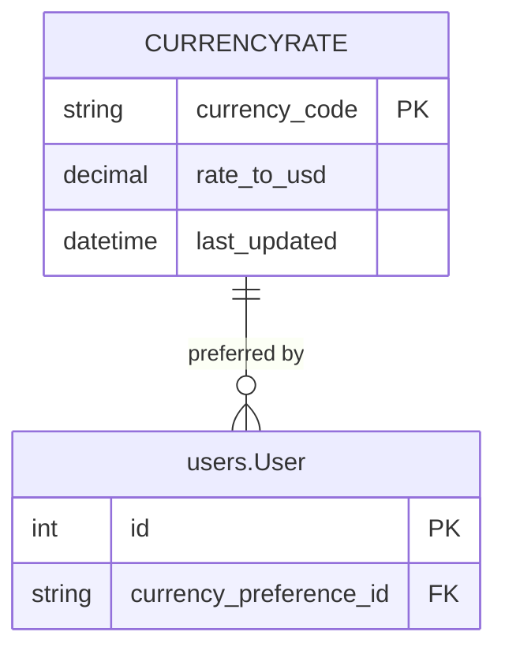

## 3. Data Models

| Model | Purpose | Key Fields |
|---|---|---|
| `CurrencyRate` | High-precision exchange rate storage (Decimal, 6 decimal places). Primary key is the ISO 4217 code | `currency_code` (PK), `rate_to_usd` (Decimal 20,6), `last_updated` (auto). Overridden `save()` enforces Decimal typing |

## 4. Core Business Logic

**Consensus Oracle Pipeline** (Celery task, daily at 02:00 UTC):
1. **Distributed Lock**: Acquires a Redis mutex (`lock:currency_oracle`, 60s TTL) to prevent concurrent runs across workers.
2. **Async Fetch**: Hits 3 FX APIs concurrently via `httpx.AsyncClient`.
3. **Consensus Computation**: Calculates median per currency across successful sources.
4. **Data Poisoning Protection**: Discards individual rates deviating >2% from median.
5. **Anomaly Detection**: Warns if any consensus rate shifted >5% from the stored DB value.
6. **Atomic Upsert**: Updates PostgreSQL within a `transaction.atomic()` block.
7. **Redis Cache**: Stores consensus in Redis with a 48-hour TTL.
8. **WebSocket Broadcast**: Pushes `currency.updated` event to connected clients.

<details>
<summary><strong>Data Poisoning Filter — 2% Median Deviation</strong></summary>

```python
for v in values:
    if median == 0:
        clean.append(v)
        continue
    deviation = abs(v - median) / median
    if deviation <= MAX_DEVIATION_FROM_MEDIAN:  # 0.02
        clean.append(v)
    else:
        logger.warning(
            f"Data poisoning filter: {code} rate {v} "
            f"deviates {deviation:.2%} from median — discarded"
        )
```
</details>

**Universal Converter**: `convert_value(amount, from_currency, to_currency)` performs `amount / from_rate * to_rate` using pure Decimal math. Lookup chain: Redis → Database → fallback to 1.0. Never throws — returns unconverted amount on total failure.

## 5. API Endpoints & Interfaces

| Endpoint | Method | Auth | Description |
|---|---|---|---|
| `/api/currency/rates/` | GET | Public | Returns all consensus rates with staleness metadata (`is_stale`, `data_age_seconds`, `source`) |

---

# App 11: `analytics_pro_engine`

## 1. App Purpose

The `analytics_pro_engine` app provides a self-service data analytics workspace for users to upload their own datasets (CSV/Excel), store them in Oracle MinIO object storage, profile data quality, and generate AI-powered dashboards via a Celery background task. It implements a quarantine-scan-promote file lifecycle and enforces per-role storage quotas (1 GB for USER, 5 GB for DATA_ANALYST).

## 2. Entity Relationship Diagram

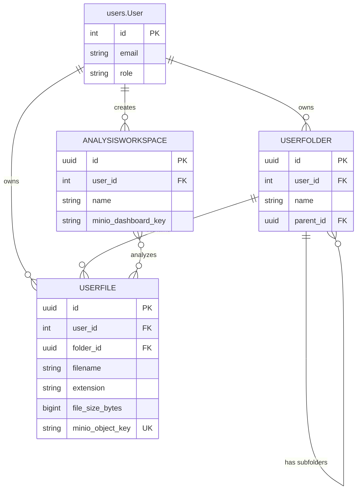

## 3. Data Models

| Model | Purpose | Key Fields |
|---|---|---|
| `UserFolder` | Hierarchical folder structure for organizing user files. Supports nesting via self-referencing FK | `user` (FK), `name`, `parent` (FK → self). Unique constraint on (user, parent, name) |
| `UserFile` | Metadata for files stored in MinIO with a unique object key | `user` (FK), `folder` (FK), `filename`, `extension`, `file_size_bytes`, `minio_object_key` (unique) |
| `AnalysisWorkspace` | Groups multiple files for analysis. Links to a generated dashboard JSON stored in MinIO | `user` (FK), `files` (M2M → UserFile), `minio_dashboard_key` |

## 4. Core Business Logic

**Quarantine → Active Promotion**: Files are uploaded to `quarantine/user_{id}/` in MinIO via a presigned URL. After ClamAV scan confirmation, the file is copied to `active/`, the quarantine version is deleted, and a MinIO tag (`Tier: Free | Premium`) is applied based on the user's role.

**AI Dashboard Generation**: The `generate_ai_dashboard` Celery task reads selected files from MinIO, performs automated analysis, and writes a dashboard JSON definition back to MinIO. The frontend polls the `AnalyzeStatusView` for completion.

## 5. API Endpoints & Interfaces

| Endpoint | Method | Auth | Description |
|---|---|---|---|
| `/api/engine/upload/request/` | POST | JWT | Generate a presigned MinIO upload URL (with quota check) |
| `/api/engine/upload/confirm/` | POST | JWT | Confirm upload: ClamAV scan, promote to active, save metadata |
| `/api/engine/quota/` | GET | JWT | Returns bytes used, total quota, and percentage |
| `/api/engine/quick-profile/<file_id>/` | GET | JWT | Profile first 100 rows: columns, row count, missing values |
| `/api/engine/analyze/` | POST | JWT | Create workspace from file IDs, trigger Celery AI analysis |
| `/api/engine/analyze/status/<workspace_id>/` | GET | JWT | Poll analysis status, returns dashboard presigned URL when done |

---

# App 12: `subscriptions`

## 1. App Purpose

The `subscriptions` app integrates Stripe billing into the SmartMove platform. It manages the lifecycle of customer profiles, Stripe Checkout sessions, webhook event processing, and the **Tri-Layer Storage Math** that computes each user's total storage allowance. It supports 7 plan types including the Data Analyst upgrade, premium bundles, regional report mailings, and storage expansion add-ons. An internal API exposes regional mailing lists to the Airflow pipeline for automated report dispatch.

## 2. Entity Relationship Diagram

```mermaid
erDiagram
    CUSTOMERPROFILE {
        int id PK
        int user_id FK_UK
        string stripe_customer_id UK
        string role
        int additional_storage_gb
    }

    SUBSCRIPTION {
        int id PK
        int user_id FK
        string stripe_subscription_id UK
        string stripe_price_id
        string plan_type
        string status
        datetime current_period_end
        boolean cancel_at_period_end
    }

    USER["users.User"] {
        int id PK
        string email
        string role
    }

    USER ||--|| CUSTOMERPROFILE : "has profile"
    USER ||--o{ SUBSCRIPTION : "subscribes to"
```

## 3. Data Models

| Model | Purpose | Key Fields |
|---|---|---|
| `CustomerProfile` | Master billing profile linking Django user → Stripe customer. Contains the Tri-Layer storage math | `user` (1:1), `stripe_customer_id`, `role` (user/data_analyst), `additional_storage_gb`. `get_total_storage_allowance()` computes Base + Bundle + Slider |
| `Subscription` | Individual recurring billing item from Stripe. A user can have multiple active subscriptions | `user` (FK), `stripe_subscription_id`, `plan_type` (7 options), `status` (active/trialing/canceled/past_due), `current_period_end`, `cancel_at_period_end` |

## 4. Core Business Logic

**Tri-Layer Storage Math**: Total storage = Base (1GB free / 5GB analyst) + Bundle Bonus (+5GB if premium_bundle active) + Slider (à la carte `additional_storage_gb`). This is called by both the Upload app and the Analytics Pro Engine to enforce quotas.

**Stripe Webhook Router**: The `StripeWebhookAPIView` verifies the `Stripe-Signature` header cryptographically, then routes events to handlers:
- `checkout.session.completed` → Creates `Subscription` record, upgrades role if `data_analyst_tier`.
- `customer.subscription.updated` → Syncs status, period end, and cancel-at-period-end flag.
- `customer.subscription.deleted` → Marks as canceled, reverts role to free, zeros storage slider.

<details>
<summary><strong>Webhook: Role Revert on Subscription Deletion</strong></summary>

```python
def _handle_subscription_deleted(self, stripe_sub):
    local_sub = Subscription.objects.get(
        stripe_subscription_id=str(stripe_sub['id'])
    )
    local_sub.status = 'canceled'
    local_sub.save()
    if local_sub.plan_type == 'data_analyst_tier':
        profile, _ = CustomerProfile.objects.get_or_create(
            user=local_sub.user
        )
        profile.role = 'user'
        profile.save()
    if local_sub.plan_type == 'storage_expansion':
        profile, _ = CustomerProfile.objects.get_or_create(
            user=local_sub.user
        )
        profile.additional_storage_gb = 0
        profile.save()
```
</details>

## 5. API Endpoints & Interfaces

| Endpoint | Method | Auth | Description |
|---|---|---|---|
| `/api/subscriptions/api/checkout/` | POST | JWT | Creates a Stripe Checkout session for a given price/plan |
| `/api/subscriptions/api/cancel/` | POST | JWT | Immediately cancels a specific subscription plan |
| `/api/subscriptions/api/status/` | GET | JWT | Returns active plans, role, and total MinIO storage |
| `/api/subscriptions/api/webhook/` | POST | Stripe Signature | Receives and routes Stripe billing events |
| `/api/subscriptions/api/airflow/mailing-list/` | GET | Airflow Secret | Returns regional mailing lists for report dispatch |
| `/api/subscriptions/matrix/` | GET | JWT | Subscription matrix filter for admin dashboards |

---

# App 13: `agentic_ai`

## 1. App Purpose

The `agentic_ai` app powers the next-generation **Multi-Agent Swarm** system for deep, multi-turn analysis of user-uploaded datasets stored in MinIO. It provides persistent conversation sessions with full message history, tracks token consumption across multiple LLM providers (Azure GPT-4o, Google Gemini) for cost accounting, and integrates with the `analytics_pro_engine` workspace system for context-aware analysis.

## 2. Entity Relationship Diagram

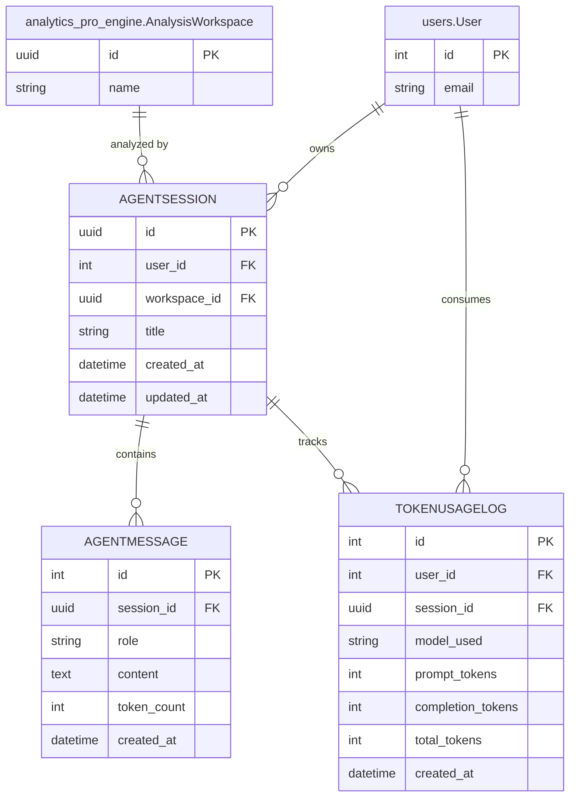

## 3. Data Models

| Model | Purpose | Key Fields |
|---|---|---|
| `AgentSession` | Groups a single conversation thread linked to a user and optionally a MinIO workspace | `user` (FK), `workspace` (FK → AnalysisWorkspace, nullable), `title` (auto-generated from first prompt) |
| `AgentMessage` | Stores full prompt history for context window management and summarization | `session` (FK), `role` (user/assistant/system), `content`, `token_count` |
| `TokenUsageLog` | Financial ledger tracking API compute costs per model per session | `user` (FK), `session` (FK), `model_used` (e.g. "azure/gpt-4o"), `prompt_tokens`, `completion_tokens`, `total_tokens` (auto-computed on save) |

## 4. Core Business Logic

**Auto-Computed Token Totals**: The `TokenUsageLog.save()` override automatically computes `total_tokens = prompt_tokens + completion_tokens` to prevent accounting errors.

**Cross-App Workspace Binding**: Sessions are linked to `AnalysisWorkspace` instances from the `analytics_pro_engine` app, giving the swarm agents full context about the user's uploaded datasets without re-uploading or re-profiling.

## 5. API Endpoints & Interfaces

| Endpoint | Method | Auth | Description |
|---|---|---|---|
| `/api/agentic-ai/session/init/` | POST | JWT | Initialize a new multi-agent swarm session |

---

# App 14: `core`

## 1. App Purpose

The `core` app provides shared, cross-cutting infrastructure services used by multiple apps. Currently, it houses the **AI Manager** — an abstraction layer for LLM provider initialization that centralizes API key management and model configuration. This prevents each app from independently initializing LLM clients and reduces the risk of key leakage.

## 2. Entity Relationship Diagram

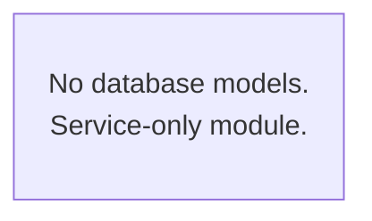

## 3. Data Models

*No database models. This app provides Python service utilities only.*

## 4. Core Business Logic

**AI Manager Service**: The `ai_manager.py` module provides a singleton-like factory for LLM client initialization, used by the `chatbot` and `agentic_ai` apps. It reads API keys from environment variables and configures provider-specific parameters (temperature, token limits, retry policies).

## 5. API Endpoints & Interfaces

*No HTTP endpoints. Used as an internal Python library by other apps.*

---

# App 15: `dashboard`

## 1. App Purpose

The `dashboard` app is a **reserved placeholder** for future dashboard aggregation APIs. It is intended to provide pre-computed summary endpoints for the Next.js frontend's dashboard views (KPI cards, regional summaries, trend sparklines). Currently contains the standard Django app scaffold with empty models, views, and URL configurations.

## 2. Entity Relationship Diagram


## 3. Data Models

*No models defined — scaffold only.*

## 4. Core Business Logic

*No business logic implemented. Future plans include cached aggregation queries and real-time WebSocket push for live dashboard updates.*

## 5. API Endpoints & Interfaces

*No endpoints defined.*

---

# Appendix: Cross-App Dependency Graph

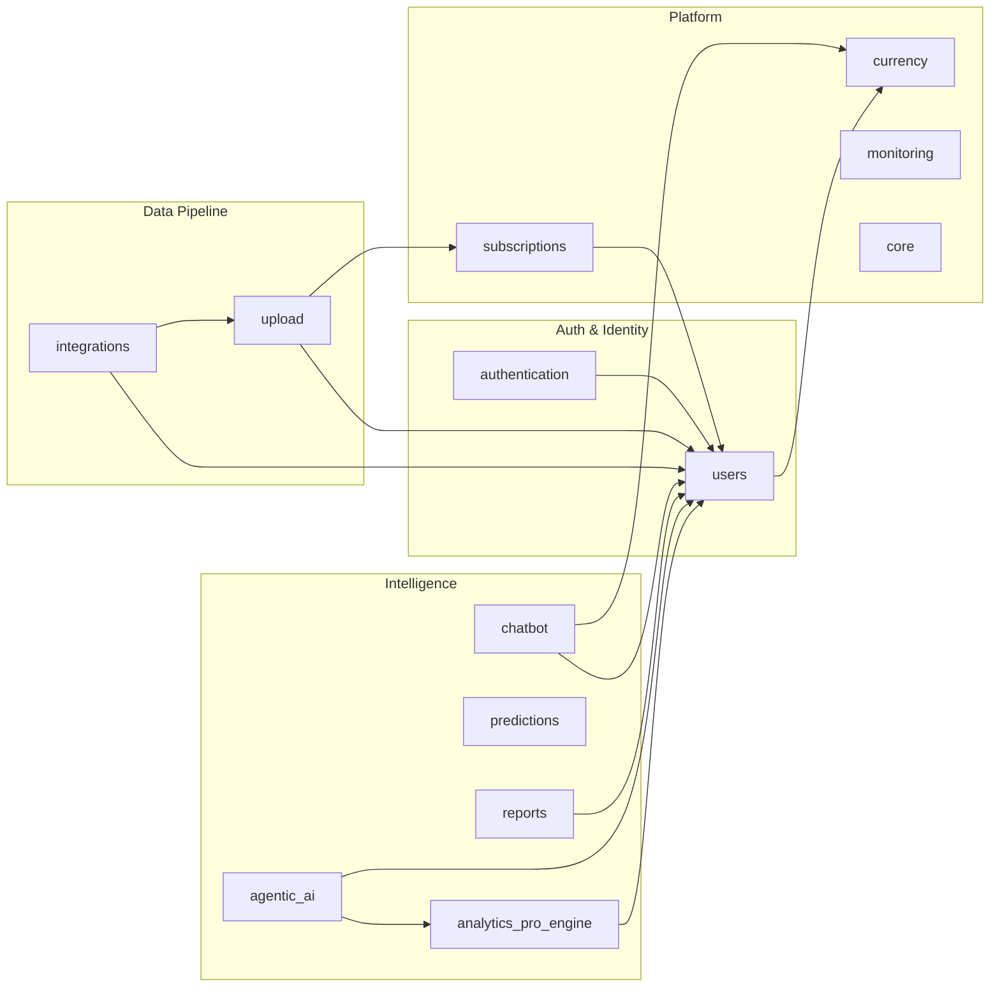

---

> **End of Documentation** · Generated by SmartMove Architecture Team
