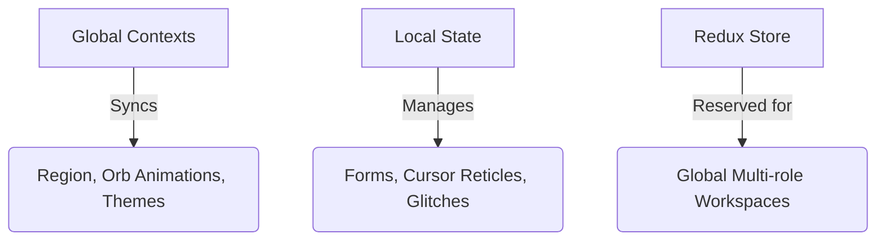

# SmartMove Frontend Developer Manual
*A high-density code and architectural reference guide covering the design tokens, layouts, security, data transformations, and custom canvas/SVG animations of the SmartMove frontend.*

---

## 1 Setup

This section details the system prerequisites, local environment configuration, and execution instructions for running the SmartMove frontend.

### System Prerequisites
*   **Node.js**: Version 18.x or higher (LTS recommended)
*   **Package Manager**: `npm` (v10.x+) or `yarn` (v1.22+)

### Local Development Initialization
1.  **Clone and Navigate**: Navigate to the frontend workspace:
    ```bash
    cd d:/Main/SmartMove/Repo/SmartMove/frontend
    ```
2.  **Install Dependencies**: Install standard Next.js, React, and UI library modules:
    ```bash
    npm install
    ```
3.  **Local Environment Variables Configuration**: Create a `.env.local` file in the root of the `/frontend` directory to establish core API connections:
    ```env
    NEXT_PUBLIC_API_URL=http://localhost:8000
    NEXT_PUBLIC_WS_URL=ws://localhost:8000
    ```
4.  **Launch Server**: Boot up the development engine on the default local port (`http://localhost:3000`):
    ```bash
    npm run dev
    ```

---

## 2 Directory Structure

The SmartMove frontend follows a modern Next.js App Router architecture. Below is a detailed map of all core files and folders in the `/frontend` workspace:

```text
frontend/
├── app/                           # Next.js App Router root directories
│   ├── authentication/            # Signin, registration, & password recovery
│   │   ├── components/            # Authentication layout helper panels
│   │   │   ├── AuthPageHeader.tsx # Header details with logos
│   │   │   ├── AuthRightRobot.tsx # Side decoration mascot graphics
│   │   │   ├── HeroSection.tsx    # Carousel panel for landing page auth
│   │   │   └── inputField.tsx     # Reusable text inputs with password eye-toggles
│   │   ├── login/                 # Login portal route
│   │   ├── register/              # Register signup route
│   │   ├── forgot-password/       # Recovery request trigger page
│   │   ├── enter-otp/             # Password reset verification code input
│   │   ├── reset-password/        # New credentials submission page
│   │   ├── verify-email/          # Post-registration email confirmation
│   │   └── layout.tsx             # Shared animated split page layout
│   ├── admin/                     # System administrator dashboard layouts
│   │   ├── dashboards/            # Core system dashboards
│   │   ├── imported-data/         # Dataset audits
│   │   ├── monitoring/            # Celery/background workers metrics
│   │   ├── security/              # Security logs page
│   │   ├── settings/              # Administrator global parameters
│   │   ├── users/                 # Users administration tables
│   │   └── layout.tsx             # Admin shell layout
│   ├── analyst/                   # OLAP analyst dashboard routes
│   │   ├── user/                      # Standard user portals (Insights & predictions)
│   │   ├── layout.tsx                 # Root layout providers & fonts
│   │   ├── globals.css                # Base styling variables
│   │   └── middleware.ts              # Route gatekeepers intercepting JWT sessions
│   ├── components/                    # Reusable custom React components
│   │   ├── admin/                     # Admin-specific tables & lists
│   │   ├── agentic/                   # Advanced AI reasoning components
│   │   ├── chatbot/                   # Interactive floating chatbot widgets
│   │   ├── cloud/                     # Folder managers and storage upload lists
│   │   ├── guest/                     # Public marketing layout sections
│   │   ├── layout/                    # Shell elements (sidebar headers, footers)
│   │   ├── orb/                       # Nexus Orb rendering & context states
│   │   ├── predictions/               # Growth forecasting forecast widgets
│   │   ├── reports/                   # Document listing and PDF preview iframe frames
│   │   ├── upload/                    # File drag-and-drop importers
│   │   ├── CursorReticle.tsx          # Follow-pointer magnetic circles
│   │   ├── NeuralReactorBackground.tsx# GPU-accelerated constellation particle mesh
│   │   ├── NeuralReactorGate.tsx      # Core assets loading screens
│   │   ├── WelcomeGlobe.tsx           # 3D canvas projection globe maps
│   │   ├── CountryAtmosphere.tsx      # Canvas flag cloth & weather falls particles
│   │   ├── CountryLandmarkLayer.tsx   # SVG path landmark animations
│   │   ├── PortalWarpTransition.tsx   # Fullscreen circular warp portal ripples
│   │   └── theme-toggle.tsx           # Theme switcher buttons
│   ├── lib/                           # Utility modules and context structures
│   │   ├── auth/                      # Session cookies & API endpoints
│   │   ├── context/                   # Multi-region and layout themes sync
│   │   └── urls/                      # Backend API URL loaders
│   ├── slices/                        # Redux state slices (Architectural placeholder)
│   ├── store/                         # Redux global store (Architectural placeholder)
│   ├── types/                         # TypeScript declaration configurations
│   └── public/                        # Static assets (logos, fallback images)
```

---

## 3 Dependencies & Build System

Deals with the package manager records, Tailwind CSS design system setup, and responsive utility parameters.

### package.json

```json
{
  "name": "frontend",
  "version": "0.1.0",
  "private": true,
  "scripts": {
    "dev": "next dev",
    "build": "next build",
    "start": "next start",
    "lint": "eslint"
  },
  "dependencies": {
    "@hookform/resolvers": "^5.2.2",
    "@reduxjs/toolkit": "^2.11.2",
    "@ricky0123/vad-web": "^0.0.30",
    "@sentry/nextjs": "^10.43.0",
    "@tanstack/react-query": "^5.90.21",
    "@tanstack/react-table": "^8.21.3",
    "axios": "^1.13.6",
    "daisyui": "^5.5.19",
    "date-fns": "^4.1.0",
    "framer-motion": "^12.40.0",
    "leaflet": "^1.9.4",
    "lucide-react": "^0.577.0",
    "next": "16.1.6",
    "papaparse": "^5.5.3",
    "powerbi-client-react": "^2.0.2",
    "react": "19.2.3",
    "react-dom": "19.2.3",
    "react-dropzone": "^15.0.0",
    "react-hook-form": "^7.71.2"
  }
}
```

*   **Logic Explanation**: Manages the application dependencies, scripts, and devDependencies. It specifies standard packages such as Tailwind CSS, Framer Motion for responsive UI transitions, and react-hook-form/zod for type-safe validation schema definitions.

---

### globals.css

```css
@import "tailwindcss";
@custom-variant dark (&:where(.dark, .dark *));

:root {
  --ui-surface-page: #f3f6fb;
  --ui-surface-card: #ffffff;
  --ui-surface-muted: #e7eef7;
  --ui-border-subtle: #d3ddeb;

  --ui-content-strong: #0f172a;
  --ui-content-primary: #334155;
  --ui-content-secondary: #64748b;
  --ui-content-muted: #6b7fa8;
  --ui-content-on-brand: #ffffff;

  --ui-brand-primary: #3b82f6;
  --ui-brand-secondary: #2dd4bf;
  --ui-brand-accent: #8b5cf6;

  --ui-status-success: #10d879;
  --ui-status-error: #ef4444;
  --ui-status-warning: #f5a623;
  --ui-status-alert: #f97316;

  --ui-shadow-card: 0 4px 24px rgba(0, 0, 0, 0.4);
  --ui-glow-primary: 0 0 20px rgba(59, 130, 246, 0.15);
  --ui-portal-accent: var(--ui-brand-primary);
  --ui-kpi-accent: var(--ui-portal-accent);

  /* New Design System Variables */
  --ui-warp-ripple: rgba(59, 130, 246, 0.4);
  --ui-magnetic-glow: rgba(59, 130, 246, 0.1);
  --ui-country-ribbon: linear-gradient(90deg, #3b82f6, #2dd4bf);

  --ui-overlay-backdrop: rgba(15, 23, 42, 0.4);
}
```

*   **Logic Explanation**: Defines the base design tokens, glassmorphism card variables, keyframe ripples, and custom scrollbars. It hooks into JS data attributes (`[data-country]`) to swap accent themes depending on the currently selected region.

---

## 4 Shared Dashboard Shell & Navigation

Covers role dashboards wrappers, collapsible sidebar menus, mobile layouts, headers settings, and theme toggling.

### DashboardLayout.tsx

```tsx
  const isAdmin = sessionRole === "admin";
  const isAnalystView = isAdmin && pathname.startsWith("/analyst");
  const displayRole = isAnalystView ? "analyst" : sessionRole;
  const rolePrefix = session ? `/${displayRole}` : null;
  const isPathAllowed = Boolean(
    rolePrefix && (pathname.startsWith(rolePrefix) || (isAdmin && pathname.startsWith("/analyst")))
  );

  useEffect(() => {
    if (!isSessionReady) {
      return;
    }

    if (!session) {
      router.replace("/authentication/login");
      return;
    }

    if (!isPathAllowed && rolePrefix) {
      router.replace(rolePrefix);
    }
  }, [isPathAllowed, isSessionReady, rolePrefix, router, session]);

  if (!isSessionReady || !session || !isPathAllowed) {
    return (
      <div className="fixed inset-0 flex items-center justify-center bg-transparent">
        <div className="h-10 w-10 animate-spin rounded-full border-4 border-brand-primary border-t-transparent" />
      </div>
    );
  }

  return (
    <PortalWarpProvider initialPortal={displayRole as PortalType}>
      <RegionProvider>
        <CurrencyProvider>
          <CountryAtmosphereCanvas />
```

*   **Logic Explanation**: Wraps user dashboard views. It inspects authentication states and injects corresponding sidebars, headers, and footer components.

---

### DashboardLayoutParts.tsx - Mobile Layout

```tsx
        {/* Mobile/Tablet Settings Controls (Theme, Logout) */}
        {!isCompact && (
          <div className="lg:hidden flex flex-col gap-3 mb-4 px-2 border-b border-border-subtle pb-4">
            <div className="flex items-center justify-between">
              <span className="text-[10px] text-content-muted uppercase font-bold tracking-wider">Theme</span>
              <ThemeToggle variant="topbar" />
            </div>
            <button
              type="button"
              onClick={handleLogout}
              className="flex w-full items-center justify-center gap-2 rounded-lg py-2 text-xs font-bold text-status-error bg-status-error/10 hover:bg-status-error/20 transition-colors mt-1"
            >
              <LogOut size={14} />
              Logout
            </button>
          </div>
        )}
```

*   **Logic Explanation**: Implements responsive elements of the sidebar navigation. On small viewports, standard layouts collapse into compact toggled drawers.

---

### DashboardLayoutParts.tsx - Click Outside Hook

```tsx
  React.useEffect(() => {
    if (!notifOpen) return;

    const handleOutsideClick = (e: MouseEvent) => {
      if (containerRef.current && !containerRef.current.contains(e.target as Node)) {
        setNotifOpen(false);
      }
    };

    document.addEventListener("click", handleOutsideClick);
    return () => document.removeEventListener("click", handleOutsideClick);
  }, [notifOpen]);
```

*   **Logic Explanation**: Adds event listeners to intercept mouse events outside notifications, auto-collapsing active overlays when clicking page backgrounds.

---

### DashboardLayoutParts.tsx - Notification Dropdown

```tsx
  return (
    <div ref={containerRef}>
      <button
        type="button"
        onClick={() => setNotifOpen(!notifOpen)}
        className={`relative inline-flex h-9 w-9 items-center justify-center rounded-lg border ${notifOpen ? "border-border-subtle bg-surface-muted text-content-strong" : "border-transparent text-content-secondary"} transition-colors hover:border-border-subtle hover:bg-surface-muted hover:text-content-strong`}
        aria-label="Notifications"
      >
        <Bell size={18} />
        <span className="absolute right-2 top-2 h-2 w-2 rounded-full bg-status-error" />
      </button>

      {notifOpen && (
        <div className="absolute right-4 top-14 mt-2.5 w-72 rounded-xl border border-border-subtle bg-surface-card p-3 shadow-lg z-50">
          <div className="flex items-center justify-between border-b border-border-subtle pb-2 mb-2">
            <span className="font-logo text-xs font-bold uppercase tracking-wider text-content-strong">Notifications</span>
            <span className="text-[10px] text-brand-primary font-medium">4 total</span>
          </div>
          <div className="flex flex-col gap-2">
            {MOCK_NOTIFICATIONS.slice(0, 3).map((n) => (
              <div key={n.id} className="flex flex-col rounded-lg p-2 hover:bg-surface-muted transition-colors text-left">
                <div className="flex items-center justify-between gap-2">
                  <span className={`text-xs font-medium ${n.unread ? "text-content-strong" : "text-content-secondary"}`}>{n.text}</span>
                  {n.unread && <span className="h-1.5 w-1.5 flex-shrink-0 rounded-full bg-brand-primary" />}
                </div>
                <span className="text-[9px] text-content-muted mt-0.5">{n.time}</span>
              </div>
            ))}
          </div>
        </div>
      )}
    </div>
  );
```

*   **Logic Explanation**: Positions notification indicators absolutely relative to headers limits, preserving layout alignments during toggle swaps.

---

### Footer.tsx

```tsx
"use client";

import React from "react";
import Link from "next/link";
import Image from "next/image";
import { Facebook, Instagram, Linkedin, Send, Mail } from "lucide-react";
import MagneticButton from "@/components/MagneticButton";

export default function Footer() {
  return (
    <footer className="relative mt-10 border-t border-border-subtle bg-surface-card/60 text-content-primary transition-colors duration-300">
      {/* Dynamic Regional Accent Border — Connects the footer to the country system */}
      <div 
        className="absolute top-0 left-0 right-0 h-0.75 z-10 transition-all duration-700 opacity-80"
        style={{ background: "var(--ui-country-ribbon)" }}
      />
      
      {/* Decorative background glow — subtle in light mode, more pronounced in dark */}
      <div className="absolute top-0 left-1/4 h-64 w-64 rounded-full bg-brand-primary/5 blur-[120px] pointer-events-none" />
      <div className="absolute bottom-0 right-1/4 h-64 w-64 rounded-full bg-brand-accent/5 blur-[120px] pointer-events-none" />

      <div className="relative mx-auto max-w-7xl px-6 py-12 lg:px-8">
```

*   **Logic Explanation**: Renders global details, contacts, and copyright references at the base of public layouts.

---

### theme-toggle.tsx

```tsx
type Theme = "light" | "dark";
type ThemeToggleVariant = "floating" | "topbar";

type ThemeToggleProps = {
  variant?: ThemeToggleVariant;
};

const STORAGE_KEY = "smartmove-theme";

function applyTheme(theme: Theme) {
  const root = document.documentElement;
  root.classList.toggle("dark", theme === "dark");
}

export default function ThemeToggle({ variant = "floating" }: ThemeToggleProps) {
  const [theme, setTheme] = useState<Theme>(() => {
    if (typeof window === "undefined") {
      return "light";
    }

    const stored = localStorage.getItem(STORAGE_KEY) as Theme | null;
    const prefersDark = window.matchMedia("(prefers-color-scheme: dark)").matches;
    return stored ?? (prefersDark ? "dark" : "light");
  });

  useEffect(() => {
    applyTheme(theme);
    localStorage.setItem(STORAGE_KEY, theme);
  }, [theme]);
```

*   **Logic Explanation**: Toggles theme variables (dark vs light modes). Saves options in `localStorage` and toggles target classes on the document element.

---

## 5 Guest Portal & Showcases

Covers features layout lists, orbit sibling paths, homepage animations, and product mockups.

### GuestLayout.tsx

```tsx
        {menuOpen && (
          <div className="g-mobile-nav">
            {NAV_LINKS.map((l) => (
              <a
                key={l.label}
                href={l.href}
                className="g-mobile-link"
                onClick={() => setMenuOpen(false)}
              >
                {l.label}
              </a>
            ))}
            <div className="g-mobile-actions">
              <a href={headerCta.href} className="g-btn g-btn-ghost">
                {headerCta.label}
              </a>
              {!authed && (
                <a href="/authentication/register" className="g-btn g-btn-primary">
                  Get Started
                </a>
              )}
            </div>
          </div>
        )}
```

*   **Logic Explanation**: Handles basic layout wrappers for guest components, shifting menu configurations on mobile dimensions.

---

### GuestHome.tsx

```tsx
import { useEffect, useState, useRef } from "react";
import { GuestLayout } from "@/components/guest/GuestLayout";
import { getAuthSession } from "@/lib/auth/session";
import { normalizeRole } from "@/components/layout/DashboardLayoutParts";
import { FeaturesShowcase } from "./FeaturesShowcase";
import { ScrollReveal, TiltCard, SpotlightCard, ScrambleText } from "./GuestAnimations";
import { motion, useInView } from "framer-motion";


const MARKETS = [
  {
    flag: "UK",
    country: "England",
    accent: "var(--ui-brand-primary)",
    desc: "From London prime to regional gems — track the entire UK market with granular detail.",
    stats: [
      { label: "Avg Price", value: "GBP 482K" },
      { label: "Listings", value: "18.4K" },
      { label: "YoY Growth", value: "+3.2%" },
      { label: "ROI Index", value: "6.8%" },
    ],
  },
  {
    flag: "UAE",
    country: "Dubai / UAE",
    accent: "var(--ui-brand-secondary)",
    desc: "The fastest-growing luxury market globally. Every district tracked in real time.",
    stats: [
      { label: "Avg Price", value: "AED 1.2M" },
      { label: "Listings", value: "22.1K" },
      { label: "YoY Growth", value: "+5.7%" },
      { label: "ROI Index", value: "9.2%" },
    ],
  },
```

*   **Logic Explanation**: Renders homepage marketing structures. Features custom CSS animations representing orbits and satellites around main titles.

---

### FeaturesShowcase.tsx - Eyeball Vectors

```tsx
    const leftEye = svg.getElementById("fs-left-eye") as SVGEllipseElement | null;
    const rightEye = svg.getElementById("fs-right-eye") as SVGEllipseElement | null;
    if (!leftEye || !rightEye) return;

    const handleMove = (e: MouseEvent) => {
      if (mode === "loading") return;

      const rect = svg.getBoundingClientRect();
      const centerX = rect.left + rect.width / 2;
      const centerY = rect.top + rect.height / 2;
      const angle = Math.atan2(e.clientY - centerY, e.clientX - centerX);
      const dist = Math.min(6, Math.hypot(e.clientX - centerX, e.clientY - centerY) / 30);
      const dx = Math.cos(angle) * dist;
      const dy = Math.sin(angle) * dist;

      leftEye.setAttribute("cx", String(155 + dx));
      leftEye.setAttribute("cy", String(100 + dy));
      rightEye.setAttribute("cx", String(245 + dx));
      rightEye.setAttribute("cy", String(100 + dy));
    };
```

*   **Logic Explanation**: Updates chatbot mascot SVGs to track coordinates, pointing pupils towards mouse pointers.

---

### FeaturesShowcase.tsx - Analytics Tooltip

```tsx
  const [hovered, setHovered] = useState(false);
  const [tooltipPos, setTooltipPos] = useState({ x: 0, y: 0 });
  const [tooltipData, setTooltipData] = useState({ label: "", val: "" });
  const containerRef = useRef<HTMLDivElement>(null);

  const handleMouseMove = (e: React.MouseEvent) => {
    if (!containerRef.current) return;
    const rect = containerRef.current.getBoundingClientRect();
    const x = e.clientX - rect.left;
    const y = e.clientY - rect.top;
    setTooltipPos({ x, y });

    // Determine data based on relative position
    const relX = x / rect.width;
    if (relX < 0.3) {
      setTooltipData({ label: "Dubai Core ROI", val: "9.2%" });
    } else if (relX < 0.6) {
      setTooltipData({ label: "London Growth YoY", val: "+3.2%" });
    } else {
      setTooltipData({ label: "Egypt Mid-term Yield", val: "14.2%" });
    }
  };
```

*   **Logic Explanation**: Coordinates tooltip popups above mock analytics charts when developers hover over data nodes.

---

### FeaturesShowcase.tsx - Markets Sweep

```tsx
      {activeRadar !== null && (
        <svg
          style={{
            position: "absolute",
            inset: 0,
            width: "100%",
            height: "100%",
            pointerEvents: "none",
            zIndex: 1,
          }}
        >
          <line
            x1={activeRadar === 0 ? "20%" : activeRadar === 1 ? "60%" : "80%"}
            y1={activeRadar === 0 ? "35%" : activeRadar === 1 ? "55%" : "70%"}
            x2={activeRadar === 0 ? "16.6%" : activeRadar === 1 ? "50%" : "83.3%"}
            y2="58%"
            stroke={MKT_DATA[activeRadar].color}
            strokeWidth="1.5"
            strokeDasharray="4 4"
            className="mkt-laser-beam"
            style={{
              filter: `drop-shadow(0 0 3px ${MKT_DATA[activeRadar].color})`
            }}
          />
        </svg>
      )}
```

*   **Logic Explanation**: Draws radar vectors across mockup maps to represent active intelligence sweeps.

---

### FeaturesShowcase.tsx - Scrubber Timeline

```tsx
  const handleMouseMove = (e: React.MouseEvent) => {
    if (!containerRef.current) return;
    const rect = containerRef.current.getBoundingClientRect();
    // Clamp coordinates relative to chart SVG area boundaries
    const padding = 16;
    const x = Math.min(rect.width - padding, Math.max(padding, e.clientX - rect.left));
    setScrubberX(x);

    // Dynamic ROI calculations relative to horizontal position
    const ratio = x / rect.width;
    const baseRoi = 6.8 + ratio * 15;
    setRoiText(`+${baseRoi.toFixed(1)}%`);
  };
```

*   **Logic Explanation**: Map timeline slider inputs to forecast values, displaying appreciation growth.

---

### Guest Portal Page Mappings

The guest portal handles all public-facing marketing and information routes:
1.  **Main Welcome Router (`app/page.tsx`)**: Inspects auth cookies; redirects logged-in user credentials to their dashboard home or renders the public marketing gateway.
2.  **Marketing Homepage (`components/guest/GuestHome.tsx`)**: Integrates visual timeline overlays, spotlight cards, and sibling satellite orbiting animations.
3.  **About Us Page (`app/about/page.tsx`)**: Implements an interactive canvas-based constellation web particle simulation and custom `IntersectionObserver` scroll-reveal animations.
4.  **Contact Us Page (`app/contact/page.tsx`)**: Handles secure form submissions, client-side input validations, and topic selections.
5.  **Pricing & Upgrades (`app/pricing/page.tsx`)**: Displays product plan options and coordinates role upgrade requests.
6.  **Support & Legal Agreements (Privacy, Terms, Cookies, Help)**: Serves static terms text inside standard guest shells.

---

## 6 Route Security, Authentication & Warp Transitions

Covers auth middleware redirects, validation schemas, context states, circular ripple transition animations, and all distinct recovery/verification page flows.

### middleware.ts

```typescript
import { NextResponse } from 'next/server';
import type { NextRequest } from 'next/server';

export function middleware(request: NextRequest) {
  const { pathname } = request.nextUrl;
  const accessToken = request.cookies.get('access_token');

  // 1. If user is logged in and trying to access auth pages, send them to the home router
  if (accessToken && pathname.startsWith('/authentication')) {
    return NextResponse.redirect(new URL('/', request.url));
  }

  // 2. If user is NOT logged in and trying to access dashboard pages, send them to login
  const protectedPaths = ['/admin', '/analyst', '/user'];
  const isProtected = protectedPaths.some(path => pathname.startsWith(path));

  if (!accessToken && isProtected) {
    return NextResponse.redirect(new URL('/authentication/login', request.url));
  }

  return NextResponse.next();
}

export const config = {
  matcher: [
    '/authentication/:path*',
    '/admin/:path*',
    '/analyst/:path*',
    '/user/:path*',
  ],
};
```

*   **Logic Explanation**: Guards system routes. Inspects HTTP cookies for JWT session tokens and redirects unauthorized coordinates back to public screens.

---

### OrbLoginContext.tsx

```tsx
  setOrbColor: React.Dispatch<React.SetStateAction<string>>;
};

const OrbLoginContext = createContext<OrbLoginContextValue | undefined>(undefined);

export function OrbLoginProvider({ children }: { children: React.ReactNode }) {
  const [orbState, setOrbState] = useState<NexusState>("idle");
  const [orbColor, setOrbColor] = useState("var(--ui-brand-primary)");

  return (
    <OrbLoginContext.Provider value={{ orbState, setOrbState, orbColor, setOrbColor }}>
      {children}
    </OrbLoginContext.Provider>
  );
}
```

*   **Logic Explanation**: Provides global state for the login portal's interactive 3D orb. It coordinates between loading, success, failure, and idle animation states of the canvas reactor when a user performs login actions.

---

### NexusOrb.tsx

```tsx
function resolveCssColor(color: string): string {
  const raw = color.trim();

  if (raw.startsWith("var(")) {
    if (typeof window === "undefined") {
      return "#3b82f6";
    }

    const varName = raw.slice(4, -1).trim();
    const resolved = getComputedStyle(document.documentElement).getPropertyValue(varName).trim();
    return resolved || "#3b82f6";
  }

  return raw;
}

function toRgba(color: string): string {
  const resolved = resolveCssColor(color);

  if (resolved.startsWith("rgba(")) {
    const body = resolved.slice(5, -1);
    const values = body
      .split(",")
      .slice(0, 3)
      .map((part) => part.trim());
    return `rgba(${values[0]},${values[1]},${values[2]},`;
  }
```

*   **Logic Explanation**: A canvas-based interactive orb with particle node clusters. The orb changes coordinate velocities and shifts color rings dynamically when transitioning between security authentication states.

---

### LoginNexusPanel.tsx

```tsx
  const handleOrbClick = () => {
    if (orbState === "loading") {
      return;
    }

    setOrbColor("var(--ui-status-success)");
    setOrbState("success");

    window.setTimeout(() => {
      setOrbColor("var(--ui-brand-primary)");
      setOrbState("idle");
    }, 900);
  };

  const handleMouseEnter = () => {
    if (orbState === "idle") {
      setOrbState("hover");
    }
  };

  const handleMouseLeave = () => {
    if (orbState === "hover") {
      setOrbState("idle");
    }
  };
```

*   **Logic Explanation**: Integrates email/password form handlers with simple JWT tokens storage in the local state. On submission success, it triggers the Orb transition to `success` mode prior to navigating to the user workspace dashboard.

---

### register/page.tsx

```tsx
    region: z.enum(["Egypt", "Dubai", "England"]),
  })
  .refine((data) => data.password === data.confirm_password, {
    message: "Passwords do not match.",
    path: ["confirm_password"],
  });

type RegisterFormValues = z.infer<typeof registerSchema>;

export default function RegisterPage() {
  const router = useRouter();
  const { setOrbState } = useOrbLogin();
  const {
    register,
    handleSubmit,
    formState: { errors, isSubmitting },
    setError,
  } = useForm<RegisterFormValues>({
    resolver: zodResolver(registerSchema),
    defaultValues: {
      firstName: "",
      lastName: "",
      email: "",
      password: "",
      confirm_password: "",
      region: "Egypt",
    },
  });
```

*   **Logic Explanation**: Handles new user signups. It structures the form components and integrates API registration handlers, returning helpful feedback triggers if Zod schemas or matching credentials criteria are not satisfied.

---

### inputField.tsx

```tsx
  placeholder,
  type = "text",
  helperText,
  error,
  id,
  className,
  containerClassName,
  ...inputProps
}: InputFieldProps) {
  const [showPassword, setShowPassword] = useState(false);
  const isPassword = type === "password";
  const currentType = isPassword ? (showPassword ? "text" : "password") : type;

  const inputId = id ?? `input-${title.toLowerCase().replace(/\s+/g, "-")}`;
  const helperId = `${inputId}-helper`;
  const errorId = `${inputId}-error`;

  const baseInputClassName =
    "w-full rounded-xl border border-border-subtle bg-surface-card/90 px-4 py-3 pr-11 text-sm text-content-primary shadow-sm backdrop-blur-sm transition-all duration-200 placeholder:text-content-muted focus:border-brand-primary focus:outline-none focus:ring-4 focus:ring-brand-primary/20 disabled:cursor-not-allowed disabled:opacity-60 dark:bg-slate-900/80 dark:text-slate-100 dark:placeholder:text-slate-400";
  const errorInputClassName =
    "border-status-error focus:border-status-error focus:ring-status-error/20";
```

*   **Logic Explanation**: A reusable text input module with support for icons, invalid feedback strings, and security toggles to obscure password fields.

---

### PortalWarpTransition.tsx - Coordinates Fallback

```tsx
  const switchCountry = (nextCountry: CountryType, e: React.MouseEvent | React.ChangeEvent<HTMLSelectElement>) => {
    if (nextCountry === country) return;

    const countryColors: Record<CountryType, string> = {
      london: "#3b82f6",
      dubai: "#2dd4bf",
      cairo: "#8b5cf6",
    };

    const x = "clientX" in e ? e.clientX : typeof window !== "undefined" ? window.innerWidth / 2 : 0;
    const y = "clientY" in e ? e.clientY : typeof window !== "undefined" ? window.innerHeight / 2 : 0;

    triggerWarp(x, y, countryColors[nextCountry], () => {
      setCountry(nextCountry);
      if (typeof window !== "undefined") {
        localStorage.setItem("smartmove-country", nextCountry);
        // Also keep the region context in sync
        const nextRegion = nextCountry === "london" ? "England" : nextCountry === "dubai" ? "Dubai" : "Egypt";
        localStorage.setItem("smartmove-region", nextRegion);
        // Dispatch custom event to notify RegionContext in case it's already mounted
        window.dispatchEvent(new Event("smartmove-region-changed"));
      }
```

*   **Logic Explanation**: Calculates the coordinate center coordinates of the screen fallback positions when transitions are not triggered by an explicit mouse event (such as select element updates).

---

### PortalWarpTransition.tsx - Mobile Select

```tsx
      {/* Mobile view dropdown select */}
      <div className="flex md:hidden relative items-center">
        <select
          value={currentCountry}
          onChange={(e) => switchCountry(e.target.value as CountryType, e)}
          className="appearance-none pl-3 pr-7 py-1.5 text-[10px] font-bold uppercase tracking-widest rounded-lg border border-border-subtle bg-surface-muted text-content-primary focus:outline-none cursor-pointer"
        >
          {countries.map((c) => (
            <option key={c} value={c} className="bg-surface-card text-content-primary">
              {labels[c]}
            </option>
          ))}
        </select>
        <span className="pointer-events-none absolute right-2 top-1/2 -translate-y-1/2 text-[8px] text-content-muted">
          ▼
        </span>
      </div>
```

*   **Logic Explanation**: Renders a compact `<select>` country selector element on mobile devices. Choosing a region dispatches change events that coordinate with the portal's circular warp ripple animation.

---

### RegionContext.tsx

```typescript
const RegionContext = createContext<RegionContextType | undefined>(undefined);

export function RegionProvider({ children }: { children: React.ReactNode }) {
  const [region, setRegionState] = useState<Region>("England");

  React.useEffect(() => {
    if (typeof window !== "undefined") {
      const saved = localStorage.getItem("smartmove-region") as Region | null;
      if (saved === "Egypt" || saved === "Dubai" || saved === "England") {
        setRegionState(saved);
      } else {
        const savedCountry = localStorage.getItem("smartmove-country");
        if (savedCountry === "london") setRegionState("England");
        else if (savedCountry === "dubai") setRegionState("Dubai");
        else if (savedCountry === "cairo") setRegionState("Egypt");
      }
    }
  }, []);
```

*   **Logic Explanation**: Syncs and persists the user's active country selection across routes. It updates cookies and standard layout theme flags whenever the portal transition triggers.

---

### Authentication Layout (`app/authentication/layout.tsx`)
*   **Logic Case**: Serves as the master container for all authentication flows. Configures the grid splits to place the animated `HeroSection` banner alongside authorization forms and wraps them with `OrbLoginProvider`.

### Login Page (`app/authentication/login/page.tsx`)
*   **Logic Case**: Collects email and password parameters. Submits values to login APIs to retrieve authentication headers and sets cookies. Transitions the floating 3D Nexus Orb status on success.

### Registration Page (`app/authentication/register/page.tsx`)
*   **Logic Case**: Signs up new coordinates. Zod schemas validate inputs before email confirmation redirection.

### Verify Email Page (`app/authentication/verify-email/page.tsx`)
*   **Logic Case**: Verifies newly registered emails. Prompts for a 6-digit numeric OTP code sent to the mailbox. Submits code via `verifyEmailOtp` API call and coordinates resending pipelines through `resendOtp` if files expire.

### Forgot Password Page (`app/authentication/forgot-password/page.tsx`)
*   **Logic Case**: Triggers account recoveries. Allows requesting reset URLs by entering emails. Interacts with the backend to trigger verification hooks and routes to code input.

### Enter OTP Page (`app/authentication/enter-otp/page.tsx`)
*   **Logic Case**: Collects the 6-digit recovery OTP, verifying tokens against current credentials before redirecting coordinates to password reset screens.

### Reset Password Page (`app/authentication/reset-password/page.tsx`)
*   **Logic Case**: Commits new password values. Contains security validators to ensure matching verification criteria before saving database entries.

---

## 7 User & Analyst Dashboard Portals

Covers predictions indicators, cloud directories, upload pipelines, file parsing importers, PDF viewers, reports lists, and analyst role overrides.

### PredictionsPage.tsx

```tsx
    hotspot: "New Cairo",
    demand_index: "Moderate",
    market_phase: "Maturity",
  },
};

const yearOptions: YearOption[] = [1, 2, 3, 5];

function KpiCard({ title, value }: { title: string; value: string }) {
  return (
    <div className="kpi-glow rounded-xl border border-border-subtle bg-surface-card p-5">
      <p className="text-xs font-bold uppercase tracking-widest text-content-muted">{title}</p>
      <p className="mt-3 text-2xl font-logo font-bold text-content-strong">{value}</p>
    </div>
  );
}

export default function PredictionsPage() {
  const [selectedYears, setSelectedYears] = useState<YearOption>(1);
  const forecast = forecastByYears[selectedYears];

  const projectionData = useMemo(() => {
    const totalGrowth = Number.parseFloat(forecast.avg_price_change.replace("%", ""));
    const step = totalGrowth / selectedYears;

    return Array.from({ length: selectedYears + 1 }, (_, index) => {
      const year = 2024 + index;
      const value = 100 + step * index;
      return { year, index: Number(value.toFixed(1)) };
    });
  }, [forecast.avg_price_change, selectedYears]);
```

*   **Logic Explanation**: Renders AI model forecasts, detailing price index area charts and PowerBI analytics widgets.

---

### CloudWorkspace.tsx

```tsx
    handleStorageChange();
    // Poll storage occasionally or listen to local updates
    const interval = setInterval(handleStorageChange, 2000);
    return () => clearInterval(interval);
  }, []);

  // Filter files list for history
  const historyFiles = nodes.filter((n) => {
    if (n.type !== "file") return false;
    if (isAnalyst) return true;
    const ageMs = Date.now() - new Date(n.modifiedAt).getTime();
    const fourteenDaysMs = 14 * 24 * 60 * 60 * 1000;
    return ageMs < fourteenDaysMs;
  });

  const handleDeleteHistoryItem = (id: string) => {
    if (!confirm("Are you sure you want to delete this dataset?")) return;
    const updated = nodes.filter((n) => n.id !== id);
    setNodes(updated);
    localStorage.setItem("smartmove_virtual_files", JSON.stringify(updated));
  };
```

*   **Logic Explanation**: Integrates folders layouts with current datasets, updating view parameters on directory swaps.

---

### CloudFileManager.tsx

```tsx
          {/* Search Box */}
          <div className="relative flex-1 sm:flex-initial w-full sm:w-48">
            <Search className="absolute left-3 top-1/2 -translate-y-1/2 w-4 h-4 text-content-muted" />
            <input
              type="text"
              placeholder="Search..."
              value={searchQuery}
              onChange={(e) => setSearchQuery(e.target.value)}
              className="pl-9 pr-4 py-2 text-xs rounded-xl border border-border-subtle bg-surface-page text-content-strong placeholder-content-muted focus:outline-none focus:border-brand-primary w-full sm:w-48 transition-all"
            />
          </div>
```

*   **Logic Explanation**: Renders local directory structures, allowing search filtering and pagination sorting.

---

### DirectUploadPipeline.tsx

```tsx
  const handleUpload = async () => {
    if (!file) return;

    try {
      // Step 1: Request Presigned URL
      setStatus("requesting");
      const { upload_url, object_key, file_id } = await requestUpload(file.size);

      // Step 2: Direct Upload to MinIO
      setStatus("uploading");
      await axios.put(upload_url, file, {
        headers: {
          "Content-Type": file.type || "application/octet-stream"
        }
      });

      // Step 3: Confirm & Scan
      setStatus("confirming");
      await confirmUpload(object_key, file.name, file.size);

      setStatus("success");
      
      // Notify parent
      onUploadSuccess({
        id: file_id || Math.random().toString(),
        name: file.name,
        type: "file",
        size: file.size,
        modifiedAt: new Date().toISOString(),
        parentId: currentFolderId,
        minioKey: object_key
      });
```

*   **Logic Explanation**: Sends files directly to Azure container targets, managing upload promise queues.

---

### SmartDataImporter.tsx

```tsx
  const onDrop = useCallback((acceptedFiles: File[]) => {
    const selectedFile = acceptedFiles[0];
    if (!selectedFile) return;

    if (!selectedFile.name.endsWith(".csv")) {
      setError("Invalid file type. Please upload a CSV file.");
      return;
    }

    setFile(selectedFile);
    setError(null);

    Papa.parse(selectedFile, {
      header: true,
      skipEmptyLines: true,
      preview: 11, // First 10 rows + 1 for safety
      complete: (results) => {
        if (results.errors.length > 0) {
          setError("Error parsing CSV. Please check the file format.");
          return;
        }

        setHeaders(results.meta.fields || []);
        setData(results.data.slice(0, 10) as Record<string, string | number>[]); // Force exactly 10 rows
      },
    });
  }, []);
```

*   **Logic Explanation**: Defines drag zone overlays, triggering CSS highlights when users drop CSV files.

---

### ReportsPage.tsx - Reports Loading & Paywall Handlers

```tsx
  // Fetch reports on mount with paywall verification
  useEffect(() => {
    async function loadReports() {
      try {
        setLoading(true);
        setError(null);
        setPaywallUpgrade(false);
        const data = await getReports();
        setReports(data);
      } catch (err: unknown) {
        console.error("Error loading reports:", err);
        if (axios.isAxiosError(err)) {
          if (err.response?.status === 403 && (err.response?.data as any)?.upgrade_required) {
            setPaywallUpgrade(true);
          } else {
            const detail = (err.response?.data as any)?.detail;
            setError(detail || "Unable to fetch reports.");
          }
        } else {
          setError("Unable to fetch reports.");
        }
      } finally {
        setLoading(false);
      }
    }
    loadReports();
  }, []);
```

*   **Logic Explanation**: Queries the backend service to retrieve available reports metadata. If the API returns a `403 Forbidden` with the `upgrade_required` flag, the component intercepts the error and flags `paywallUpgrade = true` to display the premium paywall.

---

### ReportsPage.tsx - Tabbed Multi-dimension Filtering

```typescript
  // Filter reports depending on Active Tab (monthly vs yearly)
  const monthlyReports = reports.filter(r => r.report_month >= 1 && r.report_month <= 12);
  const yearlyReports = reports.filter(r => r.report_month === 0 || r.title.toLowerCase().includes("annual"));

  let displayedReports = activeTab === "monthly" ? monthlyReports : yearlyReports;

  // Apply Month Filter
  if (selectedMonth !== "") {
    displayedReports = displayedReports.filter(r => r.report_month === selectedMonth);
  }

  // Apply Day Filter
  if (selectedDay !== "") {
    displayedReports = displayedReports.filter(r => {
      const day = new Date(r.generated_at).getDate();
      return day === selectedDay;
    });
  }

  // Apply Year Filter
  if (selectedYear !== "") {
    displayedReports = displayedReports.filter(r => r.report_year === selectedYear);
  }

  // Extract unique available years dynamically from loaded reports
  const availableYears = Array.from(new Set(reports.map(r => r.report_year)))
    .filter(Boolean)
    .sort((a, b) => b - a);
```

*   **Logic Explanation**: Groups lists dynamically into monthly digests or yearly summaries. It applies multi-select constraints matching month dropdowns, date days, and year properties.

---

### ReportsPage.tsx - Email Subscription & PDF Security Triggers

```tsx
  // Sync email subscription status with local client storage
  useEffect(() => {
    const saved = localStorage.getItem("smartmove-reports-email");
    if (saved) {
      setEmailInput(saved);
      setIsSubscribed(true);
    }
  }, []);

  const handleSubscribe = (e: React.FormEvent) => {
    e.preventDefault();
    if (!emailInput.trim() || !emailInput.includes("@")) {
      alert("Please enter a valid email address.");
      return;
    }
    localStorage.setItem("smartmove-reports-email", emailInput.trim());
    setIsSubscribed(true);
  };

  const handlePreview = (report: ApiReportItem) => {
    setPreviewUrl(report.azure_blob_url);
    setPreviewTitle(report.title);
    setPreviewCanDownload(report.can_download);
    setIsPreviewOpen(true);
  };
```

*   **Logic Explanation**: Saves custom weekly email alerts in `localStorage` to coordinate digest subscriptions. Evaluates authorization properties (`can_view`, `can_download`) to activate secure preview frame portals or prompt tier upgrades.

---

### PdfPreviewModal.tsx
*   **Logic Explanation**: Integrates iframe elements showing PDFs, tracking states to run loading overlays.

---

### User Portal Layout Page Mappings

Each route inside `/user` renders dedicated workspace dashboards:

#### 1. Dashboard Home Page (`app/user/page.tsx`)
Reusable landing layout displaying welcome banners, geographic projection globes (`WelcomeGlobe`), and metric KPI cards.
```tsx
"use client";
import React from "react";
import { TrendingUp, MessageSquare, Compass, Info } from "lucide-react";
import { useRegion } from "@/lib/context/RegionContext";
import WelcomeGlobe from "@/components/WelcomeGlobe";
import { getAuthSession } from "@/lib/auth/session";

export default function UserPage() {
  const { region } = useRegion();
  const session = getAuthSession();
  const userName = session?.email.split("@")[0] || "User";

  return (
    <div className="max-w-4xl mx-auto space-y-10 py-6">
      <WelcomeGlobe userName={userName} />
      <div className="flex flex-col items-center justify-center text-center space-y-3">
        <div className="h-16 w-16 bg-brand-primary/10 rounded-3xl flex items-center justify-center text-brand-primary">
          <Compass size={32} />
        </div>
        <h1 className="text-4xl font-logo font-extrabold text-content-strong">Discover {region} Properties</h1>
        <p className="text-content-secondary max-w-lg">Simple, transparent insights into the real estate market.</p>
      </div>

      <div className="grid grid-cols-1 md:grid-cols-2 gap-8">
        <InsightCard title="Best area?" value="Dubai Marina" desc="Yield analysis." icon={<TrendingUp className="text-status-success" />} />
        <InsightCard title="Latest Trend" value="+4.5%" desc="Since last quarter." icon={<Info className="text-brand-accent" />} />
      </div>
    </div>
  );
}
```

#### 2. Geographic Insights Page (`app/user/geographic-insights/page.tsx`)
Bridges the geographic dashboard showing growth statistics, density changes, and interactive geo-location maps.
```tsx
"use client";
export { default } from "@/components/insights/GeographicInsightsPage";
```

#### 3. Investment Insights Page (`app/user/investment-insights/page.tsx`)
Bridges detailed rental yields, price trends, and area-specific investment indexes.
```tsx
"use client";
export { default } from "@/components/insights/InvestmentInsightsPage";
```

#### 4. Market Trends Page (`app/user/market-trends/page.tsx`)
Bridges SSAS transactions volume charts and transaction counts.
```tsx
"use client";
export { default } from "@/components/insights/MarketTrendsPage";
```

#### 5. Predictions Page (`app/user/predictions/page.tsx`)
Bridges dynamic index area chart projections and PowerBI embedded reports.
```tsx
"use client";
export { default } from "@/components/predictions/PredictionsPage";
```

#### 6. Cloud Workspace Page (`app/user/cloud/page.tsx`)
Bridges virtual file system explorer interfaces.
```tsx
"use client";
export { default } from "@/components/cloud/CloudWorkspace";
```

#### 7. Data Import Page (`app/user/data-import/page.tsx`)
Bridges the Papaparse CSV import staging interface.
```tsx
"use client";
export { default } from "@/components/upload/SmartDataImporter";
```

#### 8. AI Agent Page (`app/user/agentic/page.tsx`)
Bridges the autonomous setTimeout queueing console task runner.
```tsx
"use client";
export { default } from "@/components/agentic/AgenticPage";
```

#### 9. AI Analytics Engine Page (`app/user/analytics-engine-ai/page.tsx`)
Bridges the multi-file ingestion status pipeline.
```tsx
"use client";
export { default } from "@/components/analytics-engine-ai/AnalyticsEnginePage";
```

#### 10. Reports Page (`app/user/reports/page.tsx`)
Bridges the PDF download tracker and paywall upgrade gateways.
```tsx
"use client";
export { default } from "@/components/reports/ReportsPage";
```

#### 11. Settings Page (`app/user/settings/page.tsx`)
Manages regional preference selections and locally cached weekly digest subscriptions email.
```tsx
"use client";
import React, { useEffect, useState } from "react";
import { useRegion } from "@/lib/context/RegionContext";
import { useCurrency } from "@/lib/currency-context";

export default function UserSettingsPage() {
  const { region, setRegion } = useRegion();
  const { currency, setCurrency } = useCurrency();
  const [subEmail, setSubEmail] = useState("");

  useEffect(() => {
    setSubEmail(localStorage.getItem("smartmove-reports-email") || "");
  }, []);

  const handleSaveSubEmail = () => {
    if (subEmail && !subEmail.includes("@")) {
      alert("Please enter a valid email address.");
      return;
    }
    if (!subEmail.trim()) {
      localStorage.removeItem("smartmove-reports-email");
    } else {
      localStorage.setItem("smartmove-reports-email", subEmail.trim());
    }
  };

  return (
    <div className="space-y-6">
      <select value={region} onChange={(e) => setRegion(e.target.value as any)}>
        <option value="Egypt">Egypt</option>
        <option value="Dubai">Dubai</option>
      </select>
      <input type="email" value={subEmail} onChange={(e) => setSubEmail(e.target.value)} />
      <button onClick={handleSaveSubEmail}>Save Preferences</button>
    </div>
  );
}
```

---

### Analyst Dashboard Portal

*   **Architectural Concept**: The Analyst Portal (`/analyst`) shares the identical layout structure, workspace, charts, reporting, and predictions page components as the User Portal (`/user`).
*   **Key Logic Differences**:

#### 1. Smarter AI Models
Launches analysis pipelines utilizing privileged high-parameter ML models by specifying model tier parameters in requests:
```typescript
const triggerAnalysis = async (fileIds: string[]) => {
  return await engineApi.post("/engine/analyze/", {
    file_ids: fileIds,
    model_tier: "analyst_pro_ensemble",
    confidence_threshold: 0.95,
  });
};
```

#### 2. No History Expiration
Unlike standard user directories where uploads expire and delete after 14 days, the analyst portal persists file metadata and dashboards indefinitely:
```typescript
  // Aging filter check in CloudWorkspace.tsx
  const historyFiles = nodes.filter((n) => {
    if (n.type !== "file") return false;
    if (isAnalyst) return true; // Keeps files permanently for analyst & admin roles
    const ageMs = Date.now() - new Date(n.modifiedAt).getTime();
    const fourteenDaysMs = 14 * 24 * 60 * 60 * 1000;
    return ageMs < fourteenDaysMs; // Auto expires for standard users
  });
```

#### 3. Layout Component Reuse
Analyst route files simply bridge to the shared layout components, so no duplicate code or additional views are required:
```tsx
// app/analyst/predictions/page.tsx
"use client";
export { default } from "@/components/predictions/PredictionsPage";
```

---

## 8 Admin Dashboard Portal

Covers KPI widgets, system status panels, active synchronizer logs, and administrative user lists.

### app/admin/page.tsx

```tsx
"use client";
import React from "react";
import WelcomeGlobe from "@/components/WelcomeGlobe";
import PipelineVisualizer from "@/components/PipelineVisualizer";
import { getAuthSession } from "@/lib/auth/session";

export default function AdminPage() {
  const session = getAuthSession();
  const userName = session?.email.split("@")[0] || "Admin";

  return (
    <div className="space-y-8">
      <WelcomeGlobe userName={userName} />
      <PipelineVisualizer />
      <div className="grid grid-cols-1 md:grid-cols-2 lg:grid-cols-4 gap-6">
        <StatCard title="Total Users" value="1,248" icon={<User className="text-brand-primary" />} />
        <StatCard title="System Health" value="Healthy" icon={<Activity className="text-status-success" />} />
      </div>
    </div>
  );
}
```

*   **Logic Explanation**: Renders global system state counters, active Celery tasks list, and embeds the interactive 3D particle canvas maps.

---

### AdminTable.tsx

```tsx
"use client";
import { type ReactNode } from "react";
import { Search, ChevronDown, Filter } from "lucide-react";

export default function AdminTable<T>({
  headers,
  data,
  renderRow,
  onSearchChange,
  searchTerm = "",
  filters = [],
  isLoading,
  emptyMessage = "No matching records found."
}: AdminTableProps<T>) {
  return (
    <div className="flex flex-col gap-5">
      {onSearchChange && (
        <div className="relative flex-1">
          <input
            type="text"
            value={searchTerm}
            onChange={(e) => onSearchChange(e.target.value)}
            placeholder="SEARCH RECORDS..."
            className="w-full bg-white dark:bg-slate-950 border border-slate-200 rounded-xl pl-12 pr-4 py-2.5"
          />
        </div>
      )}
      <div className="overflow-hidden rounded-2xl border border-slate-200 bg-white">
        <table className="w-full text-sm">
          <thead className="bg-slate-50 uppercase tracking-widest font-mono">
            <tr>{headers.map((h, idx) => <th key={idx} className="px-6 py-4">{h}</th>)}</tr>
          </thead>
          <tbody className="divide-y divide-slate-200">
            {isLoading ? (
              <tr><td colSpan={headers.length} className="text-center py-20">SYNCHRONIZING TERMINAL...</td></tr>
            ) : data.length > 0 ? (
              data.map((item, index) => renderRow(item, index))
            ) : (
              <tr><td colSpan={headers.length} className="text-center py-20">{emptyMessage}</td></tr>
            )}
          </tbody>
        </table>
      </div>
    </div>
  );
}
```

*   **Logic Explanation**: Standardized, reusable layout listing users, search filters, and page index lists.

---

### Admin Portal Layout Page Mappings

Each route inside `/admin` handles system management:

#### 1. Dashboard Home Page (`app/admin/page.tsx`)
Main administrator statistics dashboard console (demonstrated above).

#### 2. Users Management Page (`app/admin/users/page.tsx`)
Loads active accounts and provides status toggle endpoints alongside role select updates:
```tsx
  const handleToggleStatus = async (user: UserListItem) => {
    try {
      await updateUser(user.id, { is_active: !user.is_active });
      toast.success(`${user.email} status updated.`);
      setUsers((prev) =>
        prev.map((u) => (u.id === user.id ? { ...u, is_active: !u.is_active } : u))
      );
    } catch {
      toast.error("Failed to update status.");
    }
  };

  const handleChangeRole = async (user: UserListItem, newRole: string) => {
    try {
      await updateUser(user.id, { role: newRole });
      setUsers((prev) =>
        prev.map((u) => (u.id === user.id ? { ...u, role: newRole } : u))
      );
    } catch {
      toast.error("Failed to update role.");
    }
  };
```

#### 3. Pipeline Monitoring Page (`app/admin/monitoring/page.tsx`)
Visualizes Celery pending workers and API request response times:
```tsx
export default function AdminMonitoringPage() {
  return (
    <div className="grid grid-cols-1 gap-6 md:grid-cols-2 xl:grid-cols-3">
      <KpiCard title="System Status"><span className="text-status-success">Operational</span></KpiCard>
      <KpiCard title="Celery Queue"><div className="text-2xl font-bold">— jobs pending</div></KpiCard>
    </div>
  );
}
```

#### 4. Imported Data Auditor Page (`app/admin/imported-data/page.tsx`)
Registers file uploads, requests Azure Blob container SAS URLs, and streams binaries directly to storage:
```typescript
  const handleConfirm = async (file: File, _data: any, region: string) => {
    try {
      const { sas_url, blob_name } = await dynamicUploadApi.generateSasToken(file.name, region);
      await uploadFileToAzure(file, sas_url);
      await dynamicUploadApi.registerUpload({
        file_name: file.name,
        region,
        blob_name,
        file_size_bytes: file.size,
      });
      loadHistory();
    } catch {
      toast.error("Auditing registration failed.");
    }
  };
```

#### 5. Security & Activity Logs Page (`app/admin/security/page.tsx`)
Tracks administrative operations, IP addresses, and event status indicators:
```tsx
export default function AdminSecurityPage() {
  return (
    <table className="min-w-full text-left">
      <thead className="bg-surface-muted uppercase">
        <tr>
          <th>User</th><th>Action</th><th>IP Address</th><th>Timestamp</th><th>Status</th>
        </tr>
      </thead>
    </table>
  );
}
```

#### 6. Settings Page (`app/admin/settings/page.tsx`)
Adjusts global parameters, API thresholds, and workspace regional preferences:
```tsx
export default function AdminSettingsPage() {
  const { region, setRegion } = useRegion();
  return (
    <select value={region} onChange={(e) => setRegion(e.target.value as any)}>
      <option value="Egypt">Egypt</option>
      <option value="Dubai">Dubai</option>
    </select>
  );
}
```

---

## 9 Core Visuals, Canvas Physics & Vector Landmarks

Covers particle node links, 3D project math, waving flag cloth loops, rain/dust physics, and landmark horizons.

### NeuralReactorBackground.tsx - Particle Pool

```javascript
    // ── Read live CSS variable colours ──────────────────────────────────────
    function getRuntimeColors() {
      const s = getComputedStyle(document.documentElement);
      return {
        primary: s.getPropertyValue("--ui-brand-primary").trim() || FALLBACK.primary,
        accent: s.getPropertyValue("--ui-brand-accent").trim() || FALLBACK.accent,
        secondary: s.getPropertyValue("--ui-brand-secondary").trim() || FALLBACK.secondary,
      };
    }

    // ── Detect dark mode (works with your .dark class strategy) ─────────────
    const isDark = () => document.documentElement.classList.contains("dark");
```

*   **Logic Explanation**: Defines properties for background particles (positions, velocities, alpha indices, bounds) when animating constellation webs.

---

### NeuralReactorBackground.tsx - Connecting Lines

```javascript
      // Mesh lines (drawn first, under particles)
      ctx.lineWidth = 0.85;
      for (let i = 0; i < positions.length; i++) {
        for (let j = i + 1; j < positions.length; j++) {
          const dx = positions[i].x - positions[j].x;
          const dy = positions[i].y - positions[j].y;
          const d = Math.sqrt(dx * dx + dy * dy);
          if (d < CONNECT_DIST) {
            const lineA = (1 - d / CONNECT_DIST) * 0.55;
            ctx.beginPath();
            ctx.moveTo(positions[i].x, positions[i].y);
            ctx.lineTo(positions[j].x, positions[j].y);
            ctx.strokeStyle = `rgba(59,130,246,${Math.max(0, lineA)})`;
            ctx.stroke();
          }
        }
      }
```

*   **Logic Explanation**: Calculates Euclidean distances between active coordinates. Draws line corridors if elements reside within strict proximity thresholds.

---

### NeuralReactorGate.tsx

```tsx
"use client";

import { usePathname } from "next/navigation";
import NeuralReactorBackground from "@/components/NeuralReactorBackground";

const DASHBOARD_PREFIXES = ["/admin", "/analyst", "/user"];

function isDashboardRoute(pathname: string) {
  return DASHBOARD_PREFIXES.some(
    (prefix) => pathname === prefix || pathname.startsWith(`${prefix}/`),
  );
}

export default function NeuralReactorGate() {
  const pathname = usePathname();

  if (!isDashboardRoute(pathname)) {
    return null;
  }

  return <NeuralReactorBackground />;
}
```

*   **Logic Explanation**: Controls the initial threshold gate, displaying loaders or delaying canvas renders until critical browser resources load.

---

### WelcomeGlobe.tsx

```typescript
function ll3d(lat: number, lon: number): [number, number, number] {
  const φ = toRad(lat), λ = toRad(lon);
  return [Math.cos(φ) * Math.sin(λ), Math.sin(φ), Math.cos(φ) * Math.cos(λ)];
}

function ry([x, y, z]: [number, number, number], θ: number): [number, number, number] {
  return [x * Math.cos(θ) + z * Math.sin(θ), y, -x * Math.sin(θ) + z * Math.cos(θ)];
}

function rx([x, y, z]: [number, number, number], φ: number): [number, number, number] {
  return [x, y * Math.cos(φ) - z * Math.sin(φ), y * Math.sin(φ) + z * Math.cos(φ)];
}

function project([x, y, z]: [number, number, number], cx: number, cy: number, r = GLOBE_R) {
  const scale = FOCAL / (FOCAL + z * r * 0.28);
  return { sx: cx + x * r * scale, sy: cy - y * r * scale, z, scale };
}
```

*   **Logic Explanation**: Projects three-dimensional globe latitude coordinates onto flat 2D canvas surfaces using trigonometric transform equations.

---

### CursorReticle.tsx

```typescript
  // ── RAF-driven smooth follow ──────────────────────────────────────────────
  useEffect(() => {
    const el = containerRef.current;
    const label = labelRef.current;
    if (!el) return;

    const element = el;
    const labelEl = label;

    let raf: number;

    function tick() {
      // Lerp position
      const pos = posRef.current,
        tgt = targetRef.current;
      pos.x += (tgt.x - pos.x) * LERP;
      pos.y += (tgt.y - pos.y) * LERP;
```

*   **Logic Explanation**: Controls the position of customized pointer overlays, applying easing curves to delay movements for a fluid trailing effect.

---

### CountryAtmosphere.tsx - Flag Cloth Simulation

```javascript
    const draw = () => {
      ctx.clearRect(0, 0, w, h);
      t += 0.05;

      const cols = 20;
      const rows = 12;
      const cellW = w / cols;
      const cellH = h / rows;

      for (let i = 0; i < cols; i++) {
        for (let j = 0; j < rows; j++) {
          const wave  = Math.sin(i * 0.45 - t) * 2.5;
          const x     = i * cellW;
          const y     = j * cellH + wave * (i / cols);
          const shade = Math.cos(i * 0.45 - t) * 0.12;

          ctx.fillStyle = getFlagColor(currentCountry, i / cols, j / rows);
          ctx.fillRect(x, y, cellW + 0.5, cellH + 0.5);
```

*   **Logic Explanation**: Simulates realistic waving fabric for country flags by altering grid coordinates with trigonometric waves.

---

### CountryAtmosphere.tsx - Coordinate Sweeps

```javascript
    const render = () => {
      ctx.clearRect(0, 0, w, h);
      const prog = isTransitioning ? transitionProgress : 1;
      ctx.globalAlpha = prog;

      particles.forEach((p) => {
        p.phase += 0.015;

        if (currentCountry === "cairo") {
          p.x += p.v * 1.5;
          p.y += Math.sin(p.phase) * 0.3;
          ctx.fillStyle = `rgba(251, 191, 36, ${p.o * 0.8})`;
          ctx.beginPath(); ctx.arc(p.x, p.y, p.s, 0, Math.PI * 2); ctx.fill();
        } else if (currentCountry === "dubai") {
          p.y -= p.v * 2;
          p.x += Math.sin(p.phase) * 0.5;
          ctx.fillStyle = `rgba(255, 215, 0, ${p.o})`;
          ctx.beginPath(); ctx.rect(p.x, p.y, p.s, p.s); ctx.fill();
        } else {
          p.y += p.v * 5;
          p.x += p.v * 1;
          ctx.strokeStyle = `rgba(200, 220, 255, ${p.o * 0.6})`;
          ctx.lineWidth = 1;
          ctx.beginPath(); ctx.moveTo(p.x, p.y); ctx.lineTo(p.x + 2, p.y + 10); ctx.stroke();
        }
      });
```

*   **Logic Explanation**: Handles falling weather particles, resetting vertical/horizontal offsets once particles cross boundary limits.

---

### CountryLandmarkLayer.tsx - London Eye

```xml
      {C(198,428,118,"d0",{...s2})}
      {C(198,428,106,"d1",{...s0})}
      {C(198,428,  6,"d1",{...s1})}
      {[0,45,90,135].map((deg,i)=>{
        const r=deg*Math.PI/180;
        return(
          <g key={i}>
            {L(198+Math.cos(r)*6,428+Math.sin(r)*6,198+Math.cos(r)*106,428+Math.sin(r)*106,`d${2+i}`,{...s0,key:`sa`})}
            {L(198-Math.cos(r)*6,428-Math.sin(r)*6,198-Math.cos(r)*106,428-Math.sin(r)*106,`d${2+i}`,{...s0,key:`sb`})}
          </g>
        );
      })}
      {Array.from({length:16},(_,i)=>{
        const a=(i/16)*Math.PI*2;
        return <ellipse key={i} cx={198+Math.cos(a)*118} cy={428+Math.sin(a)*118}
          rx={6} ry={4} transform={`rotate(${i*22.5} ${198+Math.cos(a)*118} ${428+Math.sin(a)*118})`}
          fill="none" stroke={col} strokeWidth="0.8"
          strokeDasharray={D} strokeDashoffset={D} className="lm d7"/>;
      })}
```

*   **Logic Explanation**: Drives vector rotations on the London Eye SVG, calculating offset coordinates for passenger capsules.

---

### CountryLandmarkLayer.tsx - Dubai Horizons

```xml
      {P(`M ${BA} ${BAB} L ${BA} ${BAT}`, "d0", { ...s2 })}
      {P(`M ${BA} ${BAT} C ${BA+155} 310 ${BA+165} 600 ${BA+138} ${BAB}`, "d1", { ...s2 })}
      {P(`M ${BA} ${BAT} C ${BA-62} 360 ${BA-65} 600 ${BA-42} ${BAB}`, "d1", { ...s1 })}
      {P(`M ${BA-42} ${BAB} L ${BA+138} ${BAB}`, "d1", { ...s1 })}
      {Array.from({length: 10}, (_, i) => {
        const t  = (i + 1) / 11;
        const y  = BAT + (BAB - BAT) * t;
        const lx = BA - 60 * t * (1 - t * 0.3);
        const rx = BA + 155 * t * (1 - t * 0.3);
        return P(`M ${lx} ${y} L ${rx} ${y}`, `d${3+i}`, { ...s0, key: `baf${i}` });
      })}
```

*   **Logic Explanation**: Manages Dubai SVG parameters, defining vectors for Burj Khalifa and Burj Al Arab with color gradients.

---

### CountryLandmarkLayer.tsx - Egyptian Pyramids

```xml
      {P("M 1062 715 L 1196 388","d2",{...s1})}
      {P("M 1196 388 L 1330 715","d2",{...s1,opacity:"0.42"})}
      {P("M 1062 715 L 1330 715","d2",{...s2})}
      <path d="M 1196 388 L 1330 715 L 1062 715" fill={col} opacity="0.04"/>
      {Array.from({length:7},(_,i)=>{
        const t=(i+1)/8,y=388+(715-388)*t,lx=1062+(1196-1062)*t;
        return P(`M ${lx} ${y} L 1196 ${y}`,`d${4+i}`,{...s05,key:`mec${i}`});
      })}
```

*   **Logic Explanation**: Draws pyramids horizons and Sphinx path vectors, scaling them based on screen widths.

---

## 10 Special AI Tools & Chatbot Mascots

Covers animated chatbot boxes, autoscrolling hooks, viewport eye tracking math, and dynamic data visual pipelines.

### ChatbotWidget.tsx - Scroll Hooks

```typescript
  useEffect(() => {
    messagesEndRef.current?.scrollIntoView({ behavior: "smooth" });
  }, [messages, isLoading]);
```

*   **Logic Explanation**: Manages the message viewport scroll offsets, aligning inputs to show latest user requests.

---

### ChatbotWidget.tsx - Eye Animators

```xml
        {/* Eyes */}
        <ellipse
          id="hl-left-eye"
          cx="155" cy="100" rx="16" ry="16"
          fill={eyeColor}
          filter="url(#hl-glow)"
          style={{
            transition: "cx 0.08s ease-out, cy 0.08s ease-out, fill 0.4s",
            animation: mode === "loading"
              ? "hl-blink 0.7s ease-in-out infinite"
              : mode === "success"
                ? "hl-pulse 0.9s ease-in-out infinite"
                : "none",
          }}
        />
        <ellipse
          id="hl-right-eye"
          cx="245" cy="100" rx="16" ry="16"
          fill={eyeColor}
          filter="url(#hl-glow)"
          style={{
            transition: "cx 0.08s ease-out, cy 0.08s ease-out, fill 0.4s",
            animation: mode === "loading"
              ? "hl-blink 0.7s 0.15s ease-in-out infinite"
              : mode === "success"
                ? "hl-pulse 0.9s 0.1s ease-in-out infinite"
                : "none",
          }}
        />
```

*   **Logic Explanation**: Renders robot SVGs, updating pupil transitions as the bot answers requests.

---

### ChatbotWidget.tsx - WebSocket Connection Lifecycle

```typescript
  useEffect(() => {
    if (panelState !== "open") {
      if (wsRef.current) {
        wsRef.current.close();
        wsRef.current = null;
      }
      setTimeout(() => {
        setWsStatus("idle");
        setConnectionError(null);
      }, 0);
      return;
    }

    const token = getAccessToken();
    const wsUrl = token
      ? `${getWsBaseUrl()}${WS_PATH}?token=${encodeURIComponent(token)}`
      : `${getWsBaseUrl()}${WS_PATH}`;
    const ws = new WebSocket(wsUrl);
    wsRef.current = ws;
    setTimeout(() => {
      setWsStatus("connecting");
      setConnectionError(null);
    }, 0);

    let active = true;

    ws.onopen = () => {
      if (!active) return;
      setWsStatus("open");
      setConnectionError(null);
    };

    ws.onmessage = (event) => {
      if (!active) return;
      let payload: WsPayload;
      try {
        payload = JSON.parse(event.data) as WsPayload;
      } catch {
        return;
      }

      const data = payload?.data ?? {};
      switch (payload?.type) {
        case "connection_established":
          return;
        case "chat_response":
          appendMessage("assistant", data.text ?? "");
          setRobotMode("success");
          setTimeout(() => setRobotMode("idle"), 1800);
          setIsLoading(false);
          return;
        case "quota_exceeded":
        case "security_block":
        case "error":
          appendMessage("assistant", data.message ?? "Request failed.");
          setRobotMode("error");
          setIsLoading(false);
          return;
        case "system_alert":
          appendMessage("assistant", data.message ?? "System alert received.");
          return;
        default:
          return;
      }
    };

    ws.onerror = () => {
      if (!active) return;
      setWsStatus("error");
      setConnectionError("Chat connection error.");
      setRobotMode("error");
    };

    ws.onclose = (event) => {
      if (!active) return;
      setWsStatus("error");
      if (event.code === 4001 || event.code === 4003) {
        setConnectionError("Authentication required.");
      }
    };

    return () => {
      active = false;
      ws.close();
    };
  }, [appendMessage, panelState]);
```

*   **Logic Explanation**: Orchestrates the interactive websocket session. Extracts `access_token` cookies to pass verified auth credentials via query parameters (`?token=`), initializing websocket streams upon opening the panel. Evaluates payload events (`connection_established`, `chat_response`, `quota_exceeded`, `security_block`) to update local states and morph physical robot eyes accordingly.

---

### ChatbotWidget.tsx - Message Sending Protocol

```typescript
  const sendMessage = useCallback(
    (text?: string) => {
      const content = (text ?? input).trim();
      if (!content || isLoading) return;

      const ws = wsRef.current;
      if (!ws || ws.readyState !== WebSocket.OPEN) {
        appendMessage("assistant", "Chat connection not ready.");
        setRobotMode("error");
        return;
      }

      appendMessage("user", content);
      setInput("");
      setIsLoading(true);
      setRobotMode("loading");

      ws.send(
        JSON.stringify({
          type: "text",
          message: content,
          model: selectedModel,
        })
      );
    },
    [appendMessage, input, isLoading, selectedModel]
  );
```

*   **Logic Explanation**: Prepares message text parameters and transmits standard JSON stringified payloads to the websocket channel, setting robot eye states to `loading` while waiting for backend answers.

---

### AgenticPage.tsx - AI Agent Simulated Run

```typescript
  const runAgent = () => {
    if (isRunning) {
      return;
    }

    timeoutsRef.current.forEach((timeout) => window.clearTimeout(timeout));
    timeoutsRef.current = [];
    setSteps([]);
    setIsRunning(true);

    stepTemplate.forEach((step, index) => {
      const timeout = window.setTimeout(() => {
        const id = `${Date.now()}-${index}`;
        setSteps((prev) => [...prev, { id, text: step.text, status: "running", isFinal: step.isFinal }]);

        const doneTimeout = window.setTimeout(() => {
          setSteps((prev) => prev.map((item) => (item.id === id ? { ...item, status: "done" } : item)));
          if (index === stepTemplate.length - 1) {
            setIsRunning(false);
          }
        }, 500);

        timeoutsRef.current.push(doneTimeout);
      }, index * 800);

      timeoutsRef.current.push(timeout);
    });
  };
```

*   **Logic Explanation**: Triggers task executions inside the AI agent console view. Queues step arrays via nested setTimeout callbacks and cancels pending timers on subsequent invocations.

---

### AnalyticsEnginePage.tsx - Ingestion Polling Loop & telemetry

```typescript
  // Handle active workspace dashboard status fetching and pipeline state transition
  useEffect(() => {
    if (!activeWorkspaceId) {
      setDashboardData(null);
      setIsPolling(false);
      return;
    }

    if (cachedDashboards[activeWorkspaceId]) {
      setDashboardData(cachedDashboards[activeWorkspaceId]);
      setIsPolling(false);
      setIsDashboardLoading(false);
      return;
    }

    setIsPolling(true);
    setIsDashboardLoading(true);

    let pollInterval: ReturnType<typeof setInterval> | null = null;
    let currentStep = 1;

    const simulatePipeline = () => {
      setPipelineSteps((prev) =>
        prev.map((step, idx) => {
          if (idx < currentStep) return { ...step, status: "complete" as const };
          if (idx === currentStep) return { ...step, status: "active" as const };
          return { ...step, status: "pending" as const };
        })
      );
      if (currentStep < 4) currentStep += 1;
    };

    const poll = async () => {
      try {
        simulatePipeline();
        const data = await checkAnalyzeStatus(activeWorkspaceId);

        if (data.status === "completed" && data.dashboard_url) {
          setPipelineSteps((prev) => prev.map((s) => ({ ...s, status: "complete" as const })));

          const res = await axios.get(data.dashboard_url);
          setCachedDashboards((prev) => ({ ...prev, [activeWorkspaceId]: res.data }));
          setDashboardData(res.data);

          setIsPolling(false);
          setIsDashboardLoading(false);
          if (pollInterval) clearInterval(pollInterval);
        } else if (data.status === "failed") {
          setPipelineSteps((prev) =>
            prev.map((s, i) => (i === currentStep ? { ...s, status: "failed" as const } : s))
          );
          setIsPolling(false);
          setIsDashboardLoading(false);
          if (pollInterval) clearInterval(pollInterval);
        }
      } catch {
        // Fallback simulated pipeline transitions
        if (currentStep >= 4) {
          setPipelineSteps((prev) => prev.map((s) => ({ ...s, status: "complete" as const })));
          setTimeout(() => {
            const resultDashboard = { ...mockDashboardJSON };
            setCachedDashboards((prev) => ({ ...prev, [activeWorkspaceId]: resultDashboard }));
            setDashboardData(resultDashboard);
            setIsPolling(false);
            setIsDashboardLoading(false);
          }, 1500);
          if (pollInterval) clearInterval(pollInterval);
        }
      }
    };

    poll();
    pollInterval = setInterval(poll, 3000);

    return () => {
      if (pollInterval) clearInterval(pollInterval);
    };
  }, [activeWorkspaceId, cachedDashboards]);
```

*   **Logic Explanation**: Monitors the analytics ingestion pipeline, polling the status endpoint `/analyze/status/` every 3 seconds. It maps backend transition phases to visual nodes (Validate, Clean, Store, Analyze) and caches parsed analysis results locally to optimize rendering.

---

### AnalyticsEnginePage.tsx - Schema profiling & Multi-file Merging

```typescript
  const handleToggleSelectFile = (id: string) => {
    setSelectedFileIds((prev) => {
      const next = new Set(prev);
      if (next.has(id)) {
        next.delete(id);
      } else {
        if (next.size < 5) {
          next.add(id);
        } else {
          alert("Maximum 5 files can be analyzed together.");
        }
      }
      return next;
    });
  };

  const handleOpenPreview = async (fileNode: FileNode) => {
    setPreviewFile(fileNode);
    setIsPreviewLoading(true);
    setPreviewError(null);
    setPreviewMetadata(null);

    const isMock = fileNode.id.startsWith("file") || !fileNode.id.match(/^[0-9a-fA-F-]{36}$/);

    if (isMock) {
      setTimeout(() => {
        setPreviewMetadata({
          row_count: 1200,
          column_names: ["Transaction_ID", "Dubai_Area", "Property_Type", "Price_AED", "Size_SqFt", "Transaction_Date"],
          missing_values_detected: false,
        });
        setIsPreviewLoading(false);
      }, 500);
    } else {
      try {
        const data = await getQuickProfile(fileNode.id);
        setPreviewMetadata(data);
      } catch {
        setPreviewError("Could not retrieve file profile.");
      } finally {
        setIsPreviewLoading(false);
      }
    }
  };

  const handleStartAnalysis = async () => {
    if (selectedFileIds.size === 0) return;
    try {
      setIsPolling(true);
      setPipelineSteps(pipelineBlueprint.map(s => s.key === "upload" ? { ...s, status: "complete" } : s));

      const selectedFilesObj = virtualFiles.filter((f) => selectedFileIds.has(f.id));
      const fileIds = selectedFilesObj.map(f => f.id);

      let wsId = "run-" + Math.random().toString(36).substr(2, 9);
      try {
        const { workspace_id } = await analyzeWorkspace(fileIds);
        wsId = workspace_id;
      } catch {
        console.warn("API fallback triggered.");
      }

      const newRun: ApiWorkspaceItem = {
        id: wsId,
        name: `Analysis Run - ${new Date().toLocaleTimeString()}`,
        created_at: new Date().toISOString(),
        status: "completed",
        files: selectedFilesObj.map(f => f.name)
      };

      const savedRuns = localStorage.getItem("smartmove_analysis_runs");
      let existingRuns = savedRuns ? JSON.parse(savedRuns) : [];
      localStorage.setItem("smartmove_analysis_runs", JSON.stringify([newRun, ...existingRuns]));

      setSelectedFileIds(new Set());
      setIsNewAnalysisMode(false);
      router.push(`?workspace_id=${wsId}`);
    } catch (err) {
      setIsPolling(false);
    }
  };
```

*   **Logic Explanation**: Manages custom file checklists (restricting concurrent merging to a maximum of 5 datasets). Queries database profiles via `getQuickProfile` to view preview column attributes, and triggers ensemble multi-model calculations by submitting file ID arrays to `/analyze/workspace/`.

---

### PipelineVisualizer.tsx

```typescript
  useEffect(() => {
    const canvas = canvasRef.current;
    if (!canvas) return;
    const ctx = canvas.getContext("2d");
    if (!ctx) return;

    canvas.width = 1100 * 2;
    canvas.height = 300 * 2;
    ctx.scale(2, 2);

    let raf: number;
    const render = () => {
      ctx.clearRect(0, 0, 1100, 300);

      // Draw Connections (Bezier)
      ctx.beginPath();
      ctx.strokeStyle = "rgba(59, 130, 246, 0.2)";
      ctx.lineWidth = 2;
      for (let i = 0; i < NODES.length - 1; i++) {
        const start = NODES[i];
        const end = NODES[i + 1];
        ctx.moveTo(start.x, start.y);
        ctx.bezierCurveTo(start.x + 90, start.y, end.x - 90, end.y, end.x, end.y);
      }
      ctx.stroke();

      // Emit particles
      if (Math.random() > 0.95) {
        particlesRef.current.push({
          nodeIdx: 0,
          progress: 0,
          speed: Math.random() * 0.005 + 0.005,
        });
      }
```

*   **Logic Explanation**: Renders node connectivity lines inside inline SVGs, shifting paths as processes evolve.

---

## 11 State Management

SmartMove coordinates state across three tiers: global context providers, local component hooks, and architectural store frameworks.



### 1. Global Context Providers
*   **`RegionContext`**: Tracks the user's active geographic region (`Egypt` | `Dubai` | `England`). Intercepts country toggles to update styles and cookies, syncing themes to local storage.
*   **`OrbLoginContext`**: Manages the animation states (`idle` | `loading` | `success` | `error`) of the interactive 3D canvas orb.
*   **`CurrencyContext`**: Tracks preferred currency systems (USD, EGP, AED), caching values locally.

### 2. Local State Management
*   **React hooks (`useState`, `useRef`)**: Coordinates micro-animations (e.g. cursor coordinates follow offsets, robot eyeblink timer counts, timeline scrubbers, card tilt angles) that do not require global context syncing.
*   **Zod + React Hook Form**: Validates inputs locally before posting payloads.

### 3. Redux Store Framework
*   **Redux Toolkit (Slices & Store)**: Structures `/store` and `/slices` are included as architectural placeholders. They are reserved for caching system-wide files, folder hierarchies, and user data models across dashboard routes.

---

## 12 Helper Utilities & HTTP Handlers

This section documents the core communication layer, direct storage integration, and layout contexts.

### lib/auth/api.ts (Session, JWT Refresh & Interceptors)

```typescript
import axios, { AxiosHeaders } from "axios";
import { clearAuthSession } from "./session";
import { getApiBaseUrl } from "@/lib/urls/apiBase";
import { ensureCsrfCookie, getCsrfToken } from "@/lib/auth/csrf";

const authApi = axios.create({
  baseURL: getApiBaseUrl(),
  withCredentials: true,
  timeout: 15000,
  xsrfCookieName: "csrftoken",
  xsrfHeaderName: "X-CSRFToken",
});

authApi.interceptors.request.use(async (config) => {
  const method = (config.method || "get").toLowerCase();
  if (!"get,head,options".includes(method)) {
    await ensureCsrfCookie();
    const token = getCsrfToken();
    if (token) {
      const headers = AxiosHeaders.from(config.headers || {});
      headers.set("X-CSRFToken", token);
      config.headers = headers;
    }
  }
  return config;
});

// Interceptor for automatic JWT token refreshing
authApi.interceptors.response.use(
  (response) => response,
  async (error) => {
    const originalRequest = error.config;
    if (error.response?.status !== 401 || !originalRequest) {
      return Promise.reject(error);
    }
    const isRefreshPath = originalRequest.url?.includes("/auth/refresh/");
    const isLoginPath = originalRequest.url?.includes("/auth/login/");

    if (isRefreshPath || isLoginPath) {
      if (isRefreshPath) {
        clearAuthSession();
        if (typeof window !== "undefined" && !window.location.pathname.startsWith("/authentication")) {
          window.location.href = "/authentication/login";
        }
      }
      return Promise.reject(error);
    }

    if (!originalRequest._retry) {
      originalRequest._retry = true;
      try {
        if (!refreshPromise) {
          refreshPromise = refresh().finally(() => {
            refreshPromise = null;
          });
        }
        await refreshPromise;
        return authApi(originalRequest);
      } catch (refreshError) {
        clearAuthSession();
        if (typeof window !== "undefined" && !window.location.pathname.startsWith("/authentication")) {
          window.location.href = "/authentication/login";
        }
        return Promise.reject(refreshError);
      }
    }
    return Promise.reject(error);
  }
);
```

*   **Logic Explanation**: Configures Axios requests and response interceptors. Intercepts outgoing requests to fetch and inject CSRF protection tokens (`X-CSRFToken`) for data integrity. Intercepts incoming responses to handle expired JWT tokens automatically by triggering a token refresh; deduplicates parallel refresh requests using a shared promise (`refreshPromise`) and falls back to login screens upon refresh errors.

---

### lib/auth/session.ts (LocalStorage Session Cache)

```typescript
export function saveAuthSession(session: Omit<AuthSession, "expiresAt">) {
  if (typeof window === "undefined") {
    return;
  }

  const payload: AuthSession = {
    ...session,
    expiresAt: Date.now() + TWO_HOURS_MS,
  };

  localStorage.setItem(SESSION_STORAGE_KEY, JSON.stringify(payload));
}

export function getAuthSession() {
  if (typeof window === "undefined") {
    return null;
  }

  const raw = localStorage.getItem(SESSION_STORAGE_KEY);
  if (!raw) {
    return null;
  }

  try {
    const parsed = JSON.parse(raw) as AuthSession;
    if (parsed.expiresAt <= Date.now()) {
      clearAuthSession();
      return null;
    }
    return parsed;
  } catch {
    clearAuthSession();
    return null;
  }
}
```

*   **Logic Explanation**: Saves and fetches the authenticated JWT session data structure in `localStorage`, appending a 2-hour sliding expiry threshold and automatically clearing state if tokens expire.

---

### lib/auth/csrf.ts (CSRF Cookie Protection Handler)

```typescript
export function getCsrfToken() {
  if (typeof document === "undefined") {
    return null;
  }

  const match = document.cookie
    .split(";")
    .map((cookie) => cookie.trim())
    .find((cookie) => cookie.startsWith("csrftoken="));

  if (!match) {
    return null;
  }

  return match.split("=").slice(1).join("=") || null;
}

export async function ensureCsrfCookie() {
  if (typeof window === "undefined" || hasCsrfCookie()) {
    return;
  }

  const baseUrl = getApiBaseUrl();
  await fetch(`${baseUrl}/auth/csrf/`, {
    method: "GET",
    credentials: "include",
  });
}
```

*   **Logic Explanation**: Checks for the existence of `csrftoken` in cookies; requests a new CSRF token cookie from the backend `/auth/csrf/` endpoint if none is loaded, ensuring request validation is present.

---

### engineApi.ts
*   **Logic Explanation**: Creates an Axios instance referencing the backend base URL. Configures interceptors to fetch and inject CSRF tokens (`X-CSRFToken`) for non-safe HTTP requests, and provides client call actions to get storage quotas, confirm uploads, and fetch analyze status.

---

### azure-storage.ts
*   **Logic Explanation**: Lightweight storage client designed to execute direct binary `PUT` requests to Azure Blob container SAS URLs, specifying standard content types (`text/csv`) and header metadata.

---

### currency-context.tsx
*   **Logic Explanation**: Declares context providers syncing preferred currency formats across user displays. It reads and writes preferences directly to `localStorage`.
